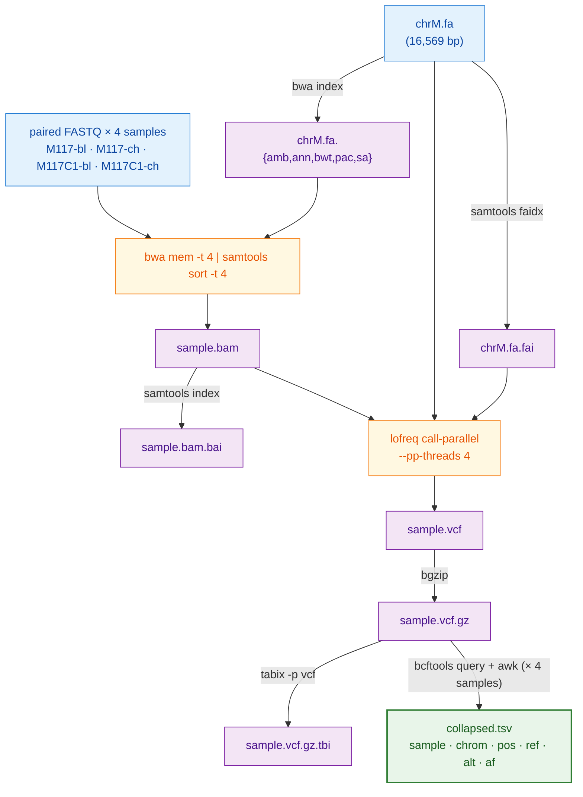

# plan-eval — can a cheap model run a strong model's bioinformatics recipe?

Opus 4.7 wrote a recipe for variant-calling on four mtDNA samples. We gave that recipe to 25 models — three Anthropic tiers plus 22 free open-weight ones — and asked each to turn it into a bash script. We ran the scripts on real data and checked their variant calls against a published answer key. Hardware: Jetson AGX Orin and RTX 5080. Three seeds per cell, several recipe styles, with-recipe and no-recipe runs, plus seven kinds of deliberate tool failure. **793 scored runs.**

## Abstract

The question: can a small model take a recipe from a strong model and produce a script that runs and gives the right answer? The task: per-sample variant calling on four mtDNA samples from Zenodo 5119008. The score: M3, the average overlap of variant calls against a published answer key. M3 = 1.000 means every call is right; M3 = 0 means none of them match.

Four findings.

**Detail beats model size.** The brief recipe (v1, ~1,200 words of prose) gives M3 ≈ 0 for most local models. The detailed recipe (v2, every command spelled out) gives M3 = 1.000 for 13 of 14 free local models on Jetson at full power. The fastest is `granite4` — 2.1 GB on disk, 15 seconds per run. Anthropic models score 1.000 on both.

**The jump is one line.** Adding one literal `lofreq` command to v1 (call that v1.25) brings every dense model ≥ 27 B parameters from M3 ≈ 0 back to 1.000. The limit is not model size but how exotic the tool's command syntax is. Lofreq takes the BAM as a positional argument, not behind a flag; v1's prose did not say so.

**No recipe means no work.** Without any recipe, every local model scores M3 = 0. Anthropic models score M3 ≥ 0.67 from what they already know. Local models cannot recover this workflow on their own.

**Error handling needs its own prose.** We broke `bwa` or `lofreq` in seven ways and ran the matrix twice — once on the regular recipe (v2) and once on a defensive variant (v2_defensive). Without the defensive prose, every model wrote the same brittle script: Opus and granite4 had the same 15 / 0 / 6 / 15 handle distribution. With it, three tiers appeared. **Six models** — Opus, Sonnet, Haiku, qwen3.6:27b, qwen3:14b, and qwen3-coder:30b — share a top tier: 21 recover / 14–15 partial / 0–1 crash. The Anthropic-and-open-weight tier boundary collapses; three free dense Qwen-family models from 9 to 18 GB sit alongside the three Anthropic tiers. One step down, `qwen3.6:35b` writes the right defensive structure but its retries succeed less often (7 recover / 29 partial). At the floor, `granite4` (2 GB) crashed on all 36 cells, unable to produce a working `try()` helper — confirmed on two hardware platforms. One useful caveat: a script that "recovered" still shipped junk if the recipe asked only that the file parse, not that it contain anything.

The headline: detail in the recipe — both for the happy path and for error handling — is what local execution needs. Model class and hardware are not what limit performance.

## 1. Objective

### 1.1 The question

Can a small or local model take a strong model's recipe and write a working script? How much does the answer change with how detailed the recipe is?

### 1.2 Why mtDNA variant calling

The human mitochondrial chromosome is a small target — 16,569 bases — and it has four useful properties for this kind of benchmark:

- **The answer is known.** The dataset comes with a tutorial that walks through the canonical workflow, written and published by the dataset's own author.
- **It runs fast.** Four short-read samples, 838 KB compressed total. Each script finishes in 8 to 17 seconds.
- **Two kinds of call.** The four samples include both clean variants (every read carries them) and low-frequency variants (about 4% of reads carry them). A score that ignored allele frequency would lose the second kind.
- **Tools are pinned.** BWA-MEM, LoFreq, bcftools — all from a locked conda environment. The model can't "improve" the toolchain; it can only run what we have.

### 1.3 What M3 measures, with an example

For each sample, list the variants in the model's VCF and the variants in the answer key. M3 is the count of variants in *both* files, divided by the count in *either* file. Average that over the four samples.

> Example: the answer key has variants {A, B, C, D}; the model's VCF has {A, B, C, E}. Variants in both = 3 (A, B, C). Variants in either = 5 (A, B, C, D, E). M3 for this sample = 3/5 = 0.6.

> Example: three of the four samples are perfect (M3 = 1.0 each), the fourth has zero overlap. Average M3 = (1 + 1 + 1 + 0) / 4 = 0.75.

A "match" requires the same chromosome, position, reference base, and alternate base, plus allele frequencies within 0.02 of each other. We use only PASS or unfiltered records. The score doesn't care which tool produced the VCF — `bcftools mpileup` or `lofreq` count the same — only the variant calls themselves.

### 1.4 Why split the work into recipe and script

Two stages. Opus 4.7 writes a recipe and we freeze it. Every implementer model gets the same recipe and writes one bash script. We run the script on the data.

Splitting like this lets us measure two things separately. The recipe's quality is one variable; the implementer's ability to follow it is another. It also gives us a clean control: Track B asks the model to write the script with no recipe at all. The drop from Track A to Track B says how much the recipe is worth.

## 2. Results

### 2.1 Detail beats model size


Figure 1 shows mean M3 for each model and each recipe variant, both hardware platforms pooled. Rows are 25 models, columns are seven recipe variants from no-recipe (left) to most detailed (right). Cells are colored by score: green is 1.000, red is 0.

The v2 column is uniformly green. The no-recipe column is red except for the three Anthropic rows. Most non-Anthropic rows jump from red on v1 to green on v2.

**Anthropic models score the same on every Track A recipe.** Opus, Sonnet, and Haiku all hit M3 = 1.000 on v1 and on v2 (n = 3 each). They know the toolchain well enough to fill in v1's gaps on their own.

**Free local models depend on detail.** On the RTX 5080, only `qwen3.6:27b` (dense) reaches v2 levels on the v1 recipe. Every other tested open-weight model scores M3 ∈ {0, 0.33} on v1 and 1.000 on v2.

**On Jetson at full power, 13 of 14 free open-weight models score M3 = 1.000 on v2** (Table 1). The exception is `nemotron-3-nano`: it writes a script in 22 seconds that runs `bgzip results/${sample}.vcf` *before* `lofreq` has produced the file, so bash exits 255 in 8 seconds — a code bug, not a recipe or budget problem. A 14th model, `olmo-3.1:32b`, never produces a single completed run; all three seeds time out at the 900-second budget. It is a thinking-mode model that does not honor Ollama's `/no_think` setting.

### 2.2 The jump is one command line


v2 is about 1,500 bytes longer than v1. Two in-between recipes test which part of that extra text matters (Figure 2, RTX 5080, Track A, n = 3 per cell):

- **v1.25 = v1 + one extra line.** The line is `lofreq call-parallel --pp-threads $T -f $REF -o $OUT $BAM`.
- **v1.5 = v2 with every prose paragraph removed.** Headings and code blocks remain; the "Gotchas" notes are gone.

For dense models ≥ 27 B (qwen3.5:27b, qwen3.6:35b-a3b, qwen3-coder:30b, gemma4:26b), v1.25 alone takes M3 to 1.000. The one tool whose syntax these models could not work out from v1's prose was `lofreq`, whose BAM goes at the end as a positional argument — not behind `-i` or `-b`. Smaller models — qwen3:14b, qwen3.5:9b, qwen3:8b, gemma4:e4b — need every command spelled out: v1.5 takes them to 1.000, while v1.25 leaves them at 0 to 0.33.

The prose paragraphs in v2 — read-group escape warnings, in-place bgzip notes, format-string conventions — do not help the implementer model. v1.5 drops them all and produces the same M3 as v2 on the models that pass v2. The recipe variants are listed in Table 2.

### 2.3 No recipe means no work


Track B gives the model only the problem and a list of tools. No recipe. Across every tested open-weight model on Track B, mean M3 is 0 — with two exceptions, both 1-of-3 flukes: qwen3:14b at 0.17 average, gemma4:26b at 0.33 average. Anthropic Opus and Sonnet reach M3 = 0.94 on Track B. Haiku reaches 0.67, dragged down by one of three runs that returns zero correct variants.

Figure 3 shows the slope plot. The open-weight lines stay near zero through Track B and Track A v1, then jump to 1.0 on Track A v2. The Anthropic lines stay near 1.0 the whole way. Open-weight models cannot guess this workflow on their own; Anthropic ones can.

A control (v0.5 = Track B + one extra line giving the order of tools, like `bwa → samtools → lofreq → bcftools → awk`) does not move the needle. M3 stays at 0 across every one of the 11 RTX 5080 models tested. Telling a model *what* to call without telling it *how* to call it is the same as telling it nothing.

### 2.4 Recipes pulled from a tool registry break weak models


If §2.2 says the v1 jump is one command line, the next question is: does that line have to be hand-written? Galaxy's IUC tool collection (`galaxyproject/tools-iuc`) is a community-maintained registry of XML wrappers, one per tool. Inside each wrapper, a `<command>` block holds a Cheetah template; at Galaxy runtime, the template fills in flag values from the user interface and emits a real command line.

We replaced the hand-authored lofreq line in v1.25 with one extracted directly from the registry — call that v1g. The extractor (`scripts/galaxy_to_snippet.py`) strips Cheetah variables, expands macros, and substitutes paths.

The bug in the extracted line: Galaxy's lofreq XML writes `--sig $value` and `--bonf $value`, where `$value` is supplied at runtime. Without Galaxy, `$value` is just empty. The Cheetah strip leaves the bare flags `--sig` and `--bonf` on adjacent lines:

```
--ref data/ref/chrM.fa --out results/{sample}.vcf
--sig
--bonf
results/{sample}.bam
```

lofreq reads `--sig --bonf` as `--sig=--bonf`, calls `float("--bonf")`, and exits with `ValueError`.

Figure 4 splits the models by whether they noticed. Opus, Sonnet, qwen3.5:27b dense, qwen3.6:27b dense, and qwen3-coder:30b dropped both flags before writing the script and scored M3 = 1.000. Haiku, qwen3.6:35b-a3b (MoE), gemma4:26b, gemma4:e4b, glm-4.7-flash, and the small qwen3 models copied the snippet exactly and shipped a script lofreq refuses to parse — M3 = 0. **Haiku scored 1.000 on v1.25 (hand-written) and 0.000 on v1g (registry) with nothing else changed.**

The IUC wrappers are templates, not stand-alone command lines. Without per-tool default values substituted at extraction time, a mechanical extractor produces strings that strong models repair and weak models copy verbatim.

### 2.5 Hardware is not what limits performance


Figure 5 Panel A plots mean generation time (log scale) against mean M3 for every (model, hardware) pair on v2 Track A. The Jetson and the RTX 5080 produce the same M3 distribution. The only points below 1.000 are model-specific: `gpt-oss:20b` runs out of output tokens on internal reasoning; `qwen3:8b` is too small; `nemotron-3-nano` has its bgzip-before-lofreq bug. The 5080 is faster (5–60 s per run for in-VRAM models) than the Jetson (15–300 s), but does not score higher.

Panel B shows the Jetson sweep at 30 W (the original 9-of-14 passers, in green) and at full power (the 5 originally-failing models retested, in purple). Four of the five passes at full power; only `olmo-3.1:32b` still times out — its three seeds all hit the 900-second wall budget. The 30 W → full-power gap is a budget effect, not a capability one. A separate harness bug — see §3.3 — explains why three of the original five "timeouts" were really misroutes, not real budget failures.

### 2.6 What happens when a tool actually breaks

Sections 2.1 to 2.5 measured the happy path. This section measures what the same models do when a tool misbehaves.

We ran 468 cells on the Jetson at full power; 234 usable cells across three open-weight models from a 48 GB MacBook M4 contributed via PR (Scott Cain); and 936 cells on a 2× NVIDIA RTX A5000 box (48 GB VRAM, recipe in `setup/RUN_ON_2xA5000.md`) that adds five large dense ollama models (gemma3:27b, granite-code:34b, mistral-small3.2:24b, qwen3:32b, llama3.3:70b-instruct-q3_K_M) plus a single-model addendum on llama3.3:70b-instruct-q4_K_M at the practical 2-GPU ceiling (~43 GB). Total usable: 1638 cells across 12 distinct ollama models, 3 Anthropic models, three hardware classes, 7 injection patterns × 1–2 target tools × 2 recipe variants × 3 seeds. The trick is **PATH shimming**. Before each run, the harness drops two short shell wrappers — one named `bwa`, one named `lofreq` — into a per-run directory and puts that directory at the front of `PATH`. When the script types `bwa mem`, bash finds the wrapper first and runs it instead of the real bwa. The wrapper reads two environment variables (`EVAL_INJECT_PATTERN`, `EVAL_INJECT_TARGET`) and either passes the call through to the real binary or simulates a failure. The model's `run.sh` doesn't know.

Seven failure patterns. Each one targets bwa, lofreq, or both. Concrete effect on the script in each case:

| pattern | what the shim does | example effect |
|---|---|---|
| `flake_first_call` | first call exits 1, the rest pass through | stderr: `lofreq: transient I/O error (eval-injected, call #1)` |
| `one_sample_fails` | exits 1 only when `M117C1-ch` is in argv | `bwa: error processing M117C1-ch (eval-injected)`; the other three samples run clean |
| `silent_truncation` *(lofreq only)* | runs the real lofreq, then truncates the `-o` file to 0 bytes | lofreq returns 0; the VCF is empty; downstream `bgzip` writes a useless `.vcf.gz` |
| `stderr_warning_storm` | dumps 200 `WARNING` lines to stderr, then runs the real tool | output correct; stderr looks alarming |
| `slow_tool` | sleeps 30 s, then runs the real tool | output identical, just delayed |
| `wrong_format_output` *(lofreq only)* | runs lofreq, then strips every variant line from the VCF; only the header survives | the file still parses; the calls section is empty |
| `missing_lib_error` | exits 127 without invoking the real tool | `lofreq: error while loading shared libraries: libhts.so.3: cannot open shared object file` |

Two recipe variants. **v2** is the happy-path recipe from §2.1; it says nothing about errors. **v2_defensive** is a new recipe (`plan/PLAN_v2_defensive.md`) that adds a `try()` helper, asks the implementer to validate every output, retries on failure, skips bad samples without aborting, writes a structured `failures.log`, and prints a summary line at the end.

Six implementer models, all on Jetson at full power: Claude Opus 4.7, Sonnet 4.6, Haiku 4.5; the strongest local from §2.1 — `qwen3.6:27b` dense, the only open-weight model that solved the v1 lean recipe; `qwen3.6:35b` dense (a different model from the same family); and `granite4`, the smallest passer of §2.1 at 2.1 GB. The 2× A5000 run extends the ollama lineup with five additional dense models that do not fit on the Jetson, the 5080, or the M4: `qwen3:32b`, `granite-code:34b`, `gemma3:27b`, `mistral-small3.2:24b`, and `llama3.3:70b-instruct-q3_K_M` (which Ollama auto-splits across both GPUs via CUDA), with a 78-cell addendum on `llama3.3:70b-instruct-q4_K_M` to test quant sensitivity at the 43 GB GPU ceiling.

Three new scores on top of M3:

- **`m_handle`** is one of `crash`, `propagate`, `partial`, `recover`. The classifier looks at exit code and at whether the script structurally announced its failures (a populated `failures.log` or a recognisable summary line). A defensive script that catches every truncation and exits 1 with all four failures logged is `partial`, not `crash`. Definition in `score/score_run.py:error_handling`.
- **`m_recover`** is binary. It compares the count of valid output VCFs to the *best achievable* count for that pattern. For `one_sample_fails` the best is 3. For `silent_truncation` and `wrong_format_output` the best is 0 (every call is supposed to be skipped). For `missing_lib_error` the best is 0. For everything else the best is 4.
- **`m_diagnose`** is binary. It triggers if `failures.log` has any rows, or a recognisable summary line appears in stderr, or a sample name and a failure word appear together on one line.


**v2 is identical across model classes.** Without error-handling prose, every model writes the same brittle script. Opus, Sonnet, Haiku, qwen3.6:27b, and qwen3.6:35b all crash on `flake_first_call`, `missing_lib_error`, and `silent_truncation`; all "recover" on `slow_tool` and `stderr_warning_storm` (waiting and ignoring noise both work); all `propagate` on `one_sample_fails` (set -e fires after three samples have already succeeded). Per-(model, plan) handle counts on v2 are **exactly** 15 recover / 0 partial / 6 propagate / 15 crash (n = 36) for **five of the six models**. Granite4 lands at 12 / 0 / 4 / 20 — a few extra crashes because it sometimes fails to write a parseable script even on the cosmetic patterns. Five rows in Figure 6's left panel are visually indistinguishable. The recipe alone does not make code defensive.

**v2_defensive splits the field, and within the top tier the A5000 lineup makes a count-vs-quality split visible.** Nine models now show the frontier *count* signature on v2_defensive (21 recover / 14–15 partial / 0–1 crash, n = 36); only five of those nine also score mean M3 ≥ 0.58 on those cells. The remaining four implement the structural skeleton but the retried calls don't produce useful output.

- **Frontier-tier by quality — five models.** Opus, Sonnet, Haiku, qwen3.6:27b (Jetson, A5000), qwen3:14b (M4). Mean M3 on v2_defensive = 0.583–0.625. Each implements the `try()` helper faithfully *and* the retried call actually produces a useful artifact. Concrete: on `flake_first_call@bwa`, every one of the five scores M3 = 1.000 across every seed — the first bwa call fails, `try` retries, the second succeeds, the BAM appears. **Two free, locally-runnable open-weight dense models — qwen3.6:27b at 17 GB and qwen3:14b at 9 GB — sit in the defensive-bash tier with Claude Opus on a *task* metric, not just a structural one.**
- **Frontier-shape by count, low quality — four models.** `qwen3-coder:30b` (M4), `mistral-small3.2:24b`, `llama3.3:70b-instruct-q3_K_M`, `llama3.3:70b-instruct-q4_K_M` (all A5000). Same 21/15/0/0 count signature, but mean M3 on v2_defensive = 0.125–0.167. The script structurally retries on every recoverable injection; the retry usually does not yield a working downstream artifact (the BAM is missing or the collapsed.tsv has no rows). **Count-shape match without quality match.** The A5000 lineup makes the distinction visible — qwen3-coder:30b was actually here all along; the M4 PR's "six-model frontier" was a count claim, not a quality claim.
- **`qwen3.6:35b`.** Writes the same defensive structure but recovers less often. Same `flake_first_call@bwa` cells: M3 = 0.333. One seed of three recovered; the other two ended in `partial` — `try` ran but the BAM never showed up. Zero crashes; partials dominate (29 of 36 cells). A larger dense model from the same family as qwen3.6:27b does *not* match the 27b dense.
- **Defensive prose makes some mid-sized models worse — three new examples on A5000.** `qwen3:32b` crashes on **all 36** v2_defensive cells (0/0/0/36) — strictly worse than granite4, which at least manages 21 partials. `gemma3:27b` lands at 0/8/0/28; `granite-code:34b` at 6/12/0/18. All three pass v2 cleanly at the standard 15/0/6/15. The `try()` helper is not a free addition; for several mid-sized open-weight models, instructing them to write defensive bash makes the script *less* reliable than the happy-path version.
- **`granite4`.** All 36 v2_defensive cells crash on Jetson; confirmed on M4. On A5000 the same model produces 4/21/0/11 — structurally more partial scripts but mean M3 still 0.000, so the recovery is non-functional in every cell. The 2 GB model cannot produce a working `try() { ... }` plus per-sample-loop `continue` in bash on any hardware tested. Floor for defensive scripting.
- **q3 ≡ q4 for `llama3.3:70b`.** The A5000 addendum (78 cells, single model `llama3.3:70b-instruct-q4_K_M`, ~43 GB split across both GPUs at the practical 2× 24 GB ceiling) reproduced the q3_K_M numbers exactly: identical per-cell counts AND identical mean M3 = 0.125 on v2_defensive. The 9 GB of extra weights between q3 and q4 did not move any cell. Within this matrix, quant level above q3 is not the bottleneck for llama3.3:70b's defensive-scripting performance.

**Pattern shape matters as much as model class.** Three patterns are not recoverable in principle and stay broken even on v2_defensive: `missing_lib_error` (the workflow cannot proceed without `libhts.so.3`), `silent_truncation`, and `wrong_format_output` (both produce files that look structurally valid but contain no real calls; a script can at best skip the bad sample). The other four patterns — `flake_first_call`, `slow_tool`, `stderr_warning_storm`, `one_sample_fails` — are fully recoverable: an aware script retries, waits, ignores, or skips. `m_recover` captures the difference.

**Diagnostic quality.** `m_diagnose` is 0 on every v2 cell. No model writes a `failures.log` without being told to. On v2_defensive it rises above 0.85 for every cell except the patterns that exit before user code runs (`missing_lib_error` returns 127 during reference indexing).

**Caveat: "recover" does not mean correct.** When `wrong_format_output` stripped every variant line from lofreq's output, every defensive Anthropic script said the file looked fine. The file *did* look fine: `bcftools view -h` parsed it. But it had no calls. M3 = 0. The defensive recipe asked for structural validation but not content. The gap is between two commands: `bcftools view -h` (does the header parse?) and `bcftools view -H | wc -l > 0` (does the file have any calls?). The first is in the recipe; the second is not. The failure here was recipe quality, not model quality. This is the most useful single thing the experiment surfaced about how to write defensive recipes.

Headline counts:

| model / plan | recover | partial | propagate | crash | n |
|---|---:|---:|---:|---:|---:|
| Claude Opus 4.7 / v2 | 15 | 0 | 6 | 15 | 36 |
| Claude Opus 4.7 / v2_defensive | 21 | 15 | 0 | 0 | 36 |
| Claude Sonnet 4.6 / v2 | 15 | 0 | 6 | 15 | 36 |
| Claude Sonnet 4.6 / v2_defensive | 21 | 14 | 0 | 1 | 36 |
| Claude Haiku 4.5 / v2 | 15 | 0 | 6 | 15 | 36 |
| Claude Haiku 4.5 / v2_defensive | 21 | 15 | 0 | 0 | 36 |
| **qwen3.6:27b / v2** | **15** | **0** | **6** | **15** | **36** |
| **qwen3.6:27b / v2_defensive** | **21** | **15** | **0** | **0** | **36** |
| **qwen3:14b / v2 (M4)** | **15** | **0** | **6** | **15** | **36** |
| **qwen3:14b / v2_defensive (M4)** | **21** | **15** | **0** | **0** | **36** |
| **qwen3-coder:30b / v2 (M4)** | 15 | 0 | 0 | **21** | 36 |
| **qwen3-coder:30b / v2_defensive (M4)** | **21** | **15** | **0** | **0** | **36** |
| qwen3.6:35b / v2 | 15 | 0 | 6 | 15 | 36 |
| qwen3.6:35b / v2_defensive | 7 | 29 | 0 | 0 | 36 |
| granite4 / v2 (Jetson) | 12 | 0 | 4 | 20 | 36 |
| granite4 / v2_defensive (Jetson) | 0 | 0 | 0 | 36 | 36 |
| granite4 / v2 (M4) | 5 | 0 | 0 | 31 | 36 |
| granite4 / v2_defensive (M4) | 0 | 0 | 0 | 36 | 36 |
| **mistral-small3.2:24b / v2 (A5000)** | **15** | **0** | **6** | **15** | **36** |
| **mistral-small3.2:24b / v2_defensive (A5000)** | **21** | **15** | **0** | **0** | **36** |
| **llama3.3:70b-q3_K_M / v2 (A5000)** | **15** | **0** | **6** | **15** | **36** |
| **llama3.3:70b-q3_K_M / v2_defensive (A5000)** | **21** | **15** | **0** | **0** | **36** |
| **llama3.3:70b-q4_K_M / v2 (A5000)** | **15** | **0** | **6** | **15** | **36** |
| **llama3.3:70b-q4_K_M / v2_defensive (A5000)** | **21** | **15** | **0** | **0** | **36** |
| qwen3:32b / v2 (A5000) | 15 | 0 | 6 | 15 | 36 |
| qwen3:32b / v2_defensive (A5000) | **0** | **0** | **0** | **36** | 36 |
| granite-code:34b / v2 (A5000) | 15 | 0 | 7 | 14 | 36 |
| granite-code:34b / v2_defensive (A5000) | 6 | 12 | 0 | 18 | 36 |
| gemma3:27b / v2 (A5000) | 15 | 0 | 6 | 15 | 36 |
| gemma3:27b / v2_defensive (A5000) | 0 | 8 | 0 | 28 | 36 |
| granite4 / v2 (A5000) | 5 | 0 | 0 | 31 | 36 |
| granite4 / v2_defensive (A5000) | 4 | 21 | 0 | 11 | 36 |

n=36 = 12 (pattern, tool) cells × 3 seeds; baseline (no-injection) cells excluded. A5000 reproduced Anthropic and qwen3.6:27b/35b rows above to identical counts (rows omitted to avoid duplication). Bold A5000 rows match the frontier *count* signature on v2_defensive but split on quality: mistral-small3.2:24b and both llama3.3:70b quants score mean M3 = 0.125 vs the true frontier's 0.583–0.625. **q3_K_M and q4_K_M of llama3.3:70b are identical row-for-row.**

### Table 1 — Headline results

| model | v2 Track A M3 | v1 Track A M3 | Track B M3 | mean v2 gen (s) | M5 pass |
|---|---:|---:|---:|---:|---:|
| Claude Opus 4.7 | 1.00±0.00 (n=3) | 1.00±0.00 (n=3) | 0.94±0.00 (n=3) | 11 | 100% |
| Claude Sonnet 4.6 | 1.00±0.00 (n=3) | 1.00±0.00 (n=3) | 0.94±0.00 (n=3) | 11 | 100% |
| Claude Haiku 4.5 | 1.00±0.00 (n=3) | 1.00±0.00 (n=3) | 0.67±0.58 (n=3) | 69 | 100% |
| `qwen3.6:27b` (dense) | 1.00±0.00 (n=3) | 1.00±0.00 (n=3) | 0.33±0.58 (n=3) | 219 | 100% |
| `qwen3.6:35b` (dense) | 1.00±0.00 (n=3) | 0.00±0.00 (n=3) | — | 100 | 100% |
| `qwen3:32b` | 1.00±0.00 (n=3) | — | — | 286 | 100% |
| `qwen3:14b` | 1.00±0.00 (n=6) | 0.00±0.00 (n=6) | 0.17±0.41 (n=6) | 10 | 33% |
| `qwen3-coder:30b` | 1.00±0.00 (n=3) | 0.33±0.58 (n=3) | 0.00±0.00 (n=3) | 105 | 0% |
| `qwen3.5:27b` | 1.00±0.00 (n=3) | 0.33±0.58 (n=3) | 0.00±0.00 (n=3) | 214 | 100% |
| `qwen3.5:9b` | 1.00±0.00 (n=3) | 0.00±0.00 (n=3) | 0.00±0.00 (n=3) | 6 | 100% |
| `qwen3:8b` | 0.83±0.41 (n=6) | 0.00±0.00 (n=6) | 0.00±0.00 (n=5) | 7 | 0% |
| `qwen3.6:35b-a3b` (MoE) | 1.00±0.00 (n=3) | 0.00±0.00 (n=3) | 0.00±0.00 (n=3) | 127 | 100% |
| `gemma3:27b` | 1.00±0.00 (n=3) | — | — | 259 | 0% |
| `gemma4:26b` | 1.00±0.00 (n=3) | 0.33±0.58 (n=3) | 0.33±0.58 (n=3) | 121 | 100% |
| `gemma4:e4b` | 1.00±0.00 (n=3) | 0.00±0.00 (n=3) | 0.00±0.00 (n=3) | 9 | 100% |
| `mistral-small3.2:24b` | 1.00±0.00 (n=3) | — | — | 170 | 100% |
| `devstral-small-2:24b` | 1.00±0.00 (n=3) | — | — | 163 | 0% |
| `granite-code:34b` | 1.00±0.00 (n=3) | — | — | 203 | 33% |
| `granite4` | 1.00±0.00 (n=3) | — | — | 15 | 100% |
| `deepseek-coder-v2:16b` (MoE) | 1.00±0.00 (n=3) | — | — | 94 | 100% |
| `glm4:9b` | 1.00±0.00 (n=3) | — | — | 55 | 33% |
| `glm-4.7-flash` (MoE) | 1.00±0.00 (n=3) | 0.67±0.58 (n=3) | 0.00±0.00 (n=3) | 90 | 50% |
| `gpt-oss:20b` (MoE) | 0.67±0.58 (n=3) | 0.00±0.00 (n=2) | 0.00 (n=1) | 174 | 83% |
| `llama3.3:70b-instruct-q3_K_M` | 1.00±0.00 (n=3) | — | — | 255 | 100% |
| `nemotron-3-nano` (24 B) | 0.00±0.00 (n=3) | — | — | 22 | 0% |
| `olmo-3.1:32b` | timeout (n=3, ≥900 s) | — | — | — | — |

Mean v2 generation seconds are computed over seeds 42/43/44 of the (model × v2) cell on whichever hardware the model was tested. M5 pass is the fraction of v2 Track A runs satisfying all five script-quality flags (§4). Where a model is untested at a given (plan, track) cell the entry is "—". M3 standard deviations are computed over the n seeds in each cell; cells with `±0.58` reflect the inevitable n=3 std of a {0, 0, 1} or {1, 1, 0} pattern.

### Table 2 — Plan variants

| variant | file | bytes | derivation | hypothesis tested |
|---|---|---:|---|---|
| **Track B** | (no plan) | 0 | problem statement + tool inventory only | how much of the workflow can the model recover from internal knowledge alone? |
| v0.5 | `prompts/track_b_with_order_user.tmpl` | 1361 | Track B + a single line giving the tool order (no flags, no commands) | does sequencing without syntax help local models? |
| v1 (lean) | `plan/PLAN_v1.md` | 3118 | Opus 4.7 from `PLANNER_PROMPT.md`: numbered bullets naming tools and key flags | baseline lean plan |
| v1.25 | `plan/PLAN_v1p25.md` | 3080 | v1 + the exact `lofreq call-parallel` command line | is the v1→v2 cliff explained by a single tool's CLI? |
| v1.5 | `plan/PLAN_v1p5.md` | 1277 | v2 with every prose paragraph and "Gotchas" block deleted, code fences kept | are the prose explanations in v2 load-bearing or decorative? |
| v1g | `plan/PLAN_v1g.md` | 4187 | v1 + Galaxy-IUC-mechanical lofreq snippet (Cheetah-strip + macro expand from `tools-iuc@39e7456`) | can a tool registry replace a human plan author? |
| v2 (detailed) | `plan/PLAN.md` | 4617 | Opus 4.7 from `PLANNER_PROMPT_v2.md`: every step gives the exact command line | reference detailed plan |
| v2_defensive | `plan/PLAN_v2_defensive.md` | 6523 | Opus 4.7 from `PLANNER_PROMPT_v2_defensive.md`: v2 plus a `try()` helper, output-validation after every step, retry-once, per-sample isolation, structured failure log, exit policy | does explicit error-handling prose make implementer scripts defensive against runtime tool failures? (§2.6) |

### Table 3 — Failure taxonomy on v2 Track A (cells with mean M3 < 1.0)

| model | hardware | n | mean M3 | M1 pass | root cause |
|---|---|---:|---:|---:|---|
| `nemotron-3-nano` | Jetson | 3 | 0.000±0.000 | 0/3 | command-ordering bug: script calls `bgzip results/${sample}.vcf` before lofreq has produced the file; exits 255 in 8 s |
| `gpt-oss:20b` | RTX 5080 | 3 | 0.667±0.577 | varies | Harmony chain-of-thought consumes the 16384-token output budget before the script is emitted (~50% of cells) |
| `qwen3:8b` | RTX 5080 | 6 | 0.833±0.408 | varies | smallest model in the lineup; near the capability floor for v2 (1/6 cells emits an empty script) |
| `olmo-3.1:32b` | Jetson | 3 | timeout | — | reasoning-mode model; 902 s × 3 seeds at MAXN, exceeds 900 s wall budget; does not respect Ollama `/no_think` |

Three of the four failures are independent of the plan-detail axis. Two are reasoning-mode budget exhaustions (one wall-clock, one token-budget); one is a script-correctness bug in code that runs to completion. Only the script-correctness case is what most readers expect a "failure" in this benchmark to look like.

### Plan variants — full text

The six plan variants in Table 2 are reproduced verbatim below. The Markdown body shown is exactly what is concatenated into the per-track user prompt (see §3.2) before sending to the implementer model — no further preprocessing.

<details>
<summary><b>v1 (lean)</b> — <code>plan/PLAN_v1.md</code>, 3118 bytes</summary>

```markdown
# Per-sample mtDNA amplicon variant-calling plan

1. **Set globals and prepare results directory**
   - Define `THREADS=4` and the sample list: `M117-bl M117-ch M117C1-bl M117C1-ch`.
   - Create `results/` if missing. Use `set -euo pipefail`.
   - Treat every output step as idempotent: guard each artifact with an existence check (e.g. skip if `results/{sample}.vcf.gz.tbi` already exists and is newer than its inputs). Re-runs on a fully populated `results/` must exit 0 without re-doing work.

2. **Reference indexing (once, in `data/ref/`)**
   - `samtools faidx data/ref/chrM.fa` → produces `chrM.fa.fai`.
   - `bwa index data/ref/chrM.fa` → produces the `.amb .ann .bwt .pac .sa` set.
   - Skip both if the index files already exist.

3. **Per-sample alignment with `bwa mem`**
   - Use `bwa mem -t 4` with the paired FASTQs `data/raw/{sample}_1.fq.gz` and `data/raw/{sample}_2.fq.gz`.
   - Pass the read group via `-R` as a single double-quoted argument containing literal backslash-t between fields and colons between key and value:
     - exact form: `-R "@RG\tID:{sample}\tSM:{sample}\tLB:{sample}\tPL:ILLUMINA"`
     - The `\t` must remain the two characters backslash and `t` — bwa parses them itself. Do NOT use `printf`, `echo -e`, `$'\t'`, or any mechanism that turns them into real tabs; bwa rejects real tabs with "the read group line contained literal <tab> characters".
     - Separators between key and value are colons `:`, not `=`.

4. **SAM → sorted BAM**
   - Pipe `bwa mem` stdout into `samtools sort -@ 4 -o results/{sample}.bam`.
   - Do NOT run `markdup` or `rmdup`: this is amplicon data where PCR duplicates are expected and biologically meaningful.

5. **BAM indexing**
   - `samtools index -@ 4 results/{sample}.bam` → `results/{sample}.bam.bai`.

6. **Variant calling with `lofreq call-parallel`**
   - Use the `call-parallel` subcommand (not plain `lofreq call`) with `--pp-threads 4`.
   - Reference: `data/ref/chrM.fa`. Input: `results/{sample}.bam`.
   - Write uncompressed VCF to a temporary path (e.g. `results/{sample}.vcf`); lofreq emits plain VCF.

7. **VCF compression and indexing**
   - Compress with `bgzip` (not `bcftools view -O z`) producing `results/{sample}.vcf.gz`.
   - Index with `tabix -p vcf results/{sample}.vcf.gz` → `results/{sample}.vcf.gz.tbi`.
   - Remove the intermediate uncompressed `.vcf`.

8. **Collapse step → `results/collapsed.tsv`**
   - For each sample, run `bcftools query -f '{sample}\t%CHROM\t%POS\t%REF\t%ALT\t%INFO/AF\n' results/{sample}.vcf.gz` (the `{sample}` literal is prepended via the format string so the sample name is attached per row).
   - Concatenate all four samples' output.
   - Prepend a single header line `sample\tchrom\tpos\tref\talt\taf` (tab-separated).
   - Output is tab-separated, one variant per line, header on, written to `results/collapsed.tsv`. Rebuild only if any input VCF is newer than the TSV.

9. **Idempotency check**
   - Final pass: re-running the script on a fully populated `results/` exits 0, performs no work, and leaves all eight per-sample artifacts plus `collapsed.tsv` intact.
```

</details>

<details>
<summary><b>v1.25</b> — <code>plan/PLAN_v1p25.md</code>, 3080 bytes (delta from v1: step 6 gains a literal <code>lofreq call-parallel</code> command line)</summary>

````markdown
# Per-sample mtDNA amplicon variant-calling plan

1. **Set globals and prepare results directory**
   - Define `THREADS=4` and the sample list: `M117-bl M117-ch M117C1-bl M117C1-ch`.
   - Create `results/` if missing. Use `set -euo pipefail`.
   - Treat every output step as idempotent: guard each artifact with an existence check (e.g. skip if `results/{sample}.vcf.gz.tbi` already exists and is newer than its inputs). Re-runs on a fully populated `results/` must exit 0 without re-doing work.

2. **Reference indexing (once, in `data/ref/`)**
   - `samtools faidx data/ref/chrM.fa` → produces `chrM.fa.fai`.
   - `bwa index data/ref/chrM.fa` → produces the `.amb .ann .bwt .pac .sa` set.
   - Skip both if the index files already exist.

3. **Per-sample alignment with `bwa mem`**
   - Use `bwa mem -t 4` with the paired FASTQs `data/raw/{sample}_1.fq.gz` and `data/raw/{sample}_2.fq.gz`.
   - Pass the read group via `-R` as a single double-quoted argument containing literal backslash-t between fields and colons between key and value:
     - exact form: `-R "@RG\tID:{sample}\tSM:{sample}\tLB:{sample}\tPL:ILLUMINA"`
     - The `\t` must remain the two characters backslash and `t` — bwa parses them itself. Do NOT use `printf`, `echo -e`, `$'\t'`, or any mechanism that turns them into real tabs; bwa rejects real tabs with "the read group line contained literal <tab> characters".
     - Separators between key and value are colons `:`, not `=`.

4. **SAM → sorted BAM**
   - Pipe `bwa mem` stdout into `samtools sort -@ 4 -o results/{sample}.bam`.
   - Do NOT run `markdup` or `rmdup`: this is amplicon data where PCR duplicates are expected and biologically meaningful.

5. **BAM indexing**
   - `samtools index -@ 4 results/{sample}.bam` → `results/{sample}.bam.bai`.

6. **Variant calling with `lofreq call-parallel`**
   - Exact command:
     ```
     lofreq call-parallel --pp-threads 4 -f data/ref/chrM.fa -o results/{sample}.vcf results/{sample}.bam
     ```
   - Output: `results/{sample}.vcf` (uncompressed). lofreq emits plain VCF.

7. **VCF compression and indexing**
   - Compress with `bgzip` (not `bcftools view -O z`) producing `results/{sample}.vcf.gz`.
   - Index with `tabix -p vcf results/{sample}.vcf.gz` → `results/{sample}.vcf.gz.tbi`.
   - Remove the intermediate uncompressed `.vcf`.

8. **Collapse step → `results/collapsed.tsv`**
   - For each sample, run `bcftools query -f '{sample}\t%CHROM\t%POS\t%REF\t%ALT\t%INFO/AF\n' results/{sample}.vcf.gz` (the `{sample}` literal is prepended via the format string so the sample name is attached per row).
   - Concatenate all four samples' output.
   - Prepend a single header line `sample\tchrom\tpos\tref\talt\taf` (tab-separated).
   - Output is tab-separated, one variant per line, header on, written to `results/collapsed.tsv`. Rebuild only if any input VCF is newer than the TSV.

9. **Idempotency check**
   - Final pass: re-running the script on a fully populated `results/` exits 0, performs no work, and leaves all eight per-sample artifacts plus `collapsed.tsv` intact.
````

</details>

<details>
<summary><b>v1.5</b> — <code>plan/PLAN_v1p5.md</code>, 1277 bytes (v2 with every prose paragraph and "Gotchas" subsection deleted; only headings + code fences)</summary>

````markdown
# Implementation Plan: Per-sample mtDNA Variant Calling

## Boilerplate (top of `run.sh`)

```
set -euo pipefail
THREADS=4
SAMPLES=("M117-bl" "M117-ch" "M117C1-bl" "M117C1-ch")
mkdir -p results
```

All per-sample steps run in `for sample in "${SAMPLES[@]}"; do ... done`.

---

## 1. Reference indexing — BWA

```
bwa index data/ref/chrM.fa
```

## 2. Reference indexing — samtools faidx

```
samtools faidx data/ref/chrM.fa
```

## 3. Per-sample alignment + sort (one pipeline)

```
bwa mem -t 4 -R "@RG\tID:{sample}\tSM:{sample}\tLB:{sample}\tPL:ILLUMINA" data/ref/chrM.fa data/raw/{sample}_1.fq.gz data/raw/{sample}_2.fq.gz | samtools sort -@ 4 -o results/{sample}.bam -
```

## 4. BAM index

```
samtools index -@ 4 results/{sample}.bam
```

## 5. Variant calling — LoFreq

```
lofreq call-parallel --pp-threads 4 -f data/ref/chrM.fa -o results/{sample}.vcf results/{sample}.bam
```

## 6. VCF compression + tabix index

```
bgzip -f results/{sample}.vcf
```
```
tabix -p vcf results/{sample}.vcf.gz
```

## 7. Collapsed TSV

```
printf 'sample\tchrom\tpos\tref\talt\taf\n' > results/collapsed.tsv
```
```
bcftools query -f '%CHROM\t%POS\t%REF\t%ALT\t%INFO/AF\n' results/{sample}.vcf.gz | awk -v s={sample} 'BEGIN{OFS="\t"}{print s,$0}' >> results/collapsed.tsv
```
````

</details>

<details>
<summary><b>v1g</b> — <code>plan/PLAN_v1g.md</code>, 4187 bytes (v1 with the lofreq snippet replaced by a mechanical extract from <code>tools-iuc@39e7456</code>)</summary>

````markdown
# Per-sample mtDNA amplicon variant-calling plan
<!--
v1g = v1 with Galaxy-IUC-derived CLI snippets injected per step where IUC has
clean coverage. Extracted mechanically by scripts/galaxy_to_snippet.py from
tools-iuc commit 39e745658a6ff7f013788871916574117a0f47f1 (2026-04-27).

IUC coverage map:
  bwa, bwa-mem        : extraction yields mostly noise (heavy macro use) — fallback to v1 prose
  samtools_faidx       : all-conditional command block — fallback to v1 prose
  samtools_sort        : partial extraction with placeholders — fallback to v1 prose
  samtools_index       : not in IUC — fallback to v1 prose
  lofreq_call_parallel : clean extraction — INJECTED (step 6)
  bgzip / tabix        : not in IUC — fallback to v1 prose
  bcftools_query       : format string in stripped Cheetah var — fallback to v1 prose
-->

1. **Set globals and prepare results directory**
   - Define `THREADS=4` and the sample list: `M117-bl M117-ch M117C1-bl M117C1-ch`.
   - Create `results/` if missing. Use `set -euo pipefail`.
   - Treat every output step as idempotent: guard each artifact with an existence check (e.g. skip if `results/{sample}.vcf.gz.tbi` already exists and is newer than its inputs). Re-runs on a fully populated `results/` must exit 0 without re-doing work.

2. **Reference indexing (once, in `data/ref/`)**
   - `samtools faidx data/ref/chrM.fa` → produces `chrM.fa.fai`.
   - `bwa index data/ref/chrM.fa` → produces the `.amb .ann .bwt .pac .sa` set.
   - Skip both if the index files already exist.

3. **Per-sample alignment with `bwa mem`**
   - Use `bwa mem -t 4` with the paired FASTQs `data/raw/{sample}_1.fq.gz` and `data/raw/{sample}_2.fq.gz`.
   - Pass the read group via `-R` as a single double-quoted argument containing literal backslash-t between fields and colons between key and value:
     - exact form: `-R "@RG\tID:{sample}\tSM:{sample}\tLB:{sample}\tPL:ILLUMINA"`
     - The `\t` must remain the two characters backslash and `t` — bwa parses them itself. Do NOT use `printf`, `echo -e`, `$'\t'`, or any mechanism that turns them into real tabs; bwa rejects real tabs with "the read group line contained literal <tab> characters".
     - Separators between key and value are colons `:`, not `=`.

4. **SAM → sorted BAM**
   - Pipe `bwa mem` stdout into `samtools sort -@ 4 -o results/{sample}.bam`.
   - Do NOT run `markdup` or `rmdup`: this is amplicon data where PCR duplicates are expected and biologically meaningful.

5. **BAM indexing**
   - `samtools index -@ 4 results/{sample}.bam` → `results/{sample}.bam.bai`.

6. **Variant calling with `lofreq call-parallel`**
   - Galaxy IUC canonical invocation (extracted from `tools/lofreq/lofreq_call.xml` @ tools-iuc 39e7456):
     ```
     lofreq call-parallel --pp-threads 4 --verbose
     --ref data/ref/chrM.fa --out results/{sample}.vcf
     --sig
     --bonf
     results/{sample}.bam
     ```
     (The bare `--sig` and `--bonf` lines come from Galaxy-runtime-supplied values; you can omit them and use lofreq's defaults. The load-bearing detail is that `results/{sample}.bam` is a **positional argument at the end**, not behind `-i`/`-b`/`-bam`.)

7. **VCF compression and indexing**
   - Compress with `bgzip` (not `bcftools view -O z`) producing `results/{sample}.vcf.gz`.
   - Index with `tabix -p vcf results/{sample}.vcf.gz` → `results/{sample}.vcf.gz.tbi`.
   - Remove the intermediate uncompressed `.vcf`.

8. **Collapse step → `results/collapsed.tsv`**
   - For each sample, run `bcftools query -f '{sample}\t%CHROM\t%POS\t%REF\t%ALT\t%INFO/AF\n' results/{sample}.vcf.gz` (the `{sample}` literal is prepended via the format string so the sample name is attached per row).
   - Concatenate all four samples' output.
   - Prepend a single header line `sample\tchrom\tpos\tref\talt\taf` (tab-separated).
   - Output is tab-separated, one variant per line, header on, written to `results/collapsed.tsv`. Rebuild only if any input VCF is newer than the TSV.

9. **Idempotency check**
   - Final pass: re-running the script on a fully populated `results/` exits 0, performs no work, and leaves all eight per-sample artifacts plus `collapsed.tsv` intact.
````

The bare `--sig` / `--bonf` lines in step 6 are the bug discussed in §2.4: Galaxy's Cheetah templating strips the runtime-supplied `$value` after each flag, leaving the bare flag on its own line. lofreq then parses `--sig --bonf` as `--sig=--bonf`, attempts `float("--bonf")`, and dies. Strong models drop both flags before emitting their script; weaker models copy the snippet character-for-character.

</details>

<details>
<summary><b>v2 (detailed)</b> — <code>plan/PLAN.md</code>, 4617 bytes</summary>

````markdown
# Implementation Plan: Per-sample mtDNA Variant Calling

## Boilerplate (top of `run.sh`)
- First line after shebang: `set -euo pipefail`.
- Constants: `THREADS=4` and `SAMPLES=("M117-bl" "M117-ch" "M117C1-bl" "M117C1-ch")`.
- Create output dir: `mkdir -p results`.
- All per-sample steps must be wrapped in `for sample in "${SAMPLES[@]}"; do ... done`.

---

## 1. Reference indexing — BWA

```
bwa index data/ref/chrM.fa
```

- Outputs (5 sibling files): `data/ref/chrM.fa.amb`, `.ann`, `.bwt`, `.pac`, `.sa`.
- Idempotency guard: `[[ -f data/ref/chrM.fa.bwt ]] || bwa index data/ref/chrM.fa`
- Gotcha: `bwa index` writes outputs next to the input; the dir must be writable. No flags needed for a 16 kb reference (default algorithm is fine).

## 2. Reference indexing — samtools faidx

```
samtools faidx data/ref/chrM.fa
```

- Output: `data/ref/chrM.fa.fai`.
- Guard: `[[ -f data/ref/chrM.fa.fai ]] || samtools faidx data/ref/chrM.fa`

## 3. Per-sample alignment + sort (one pipeline)

```
bwa mem -t 4 -R "@RG\tID:{sample}\tSM:{sample}\tLB:{sample}\tPL:ILLUMINA" data/ref/chrM.fa data/raw/{sample}_1.fq.gz data/raw/{sample}_2.fq.gz | samtools sort -@ 4 -o results/{sample}.bam -
```

- Output: `results/{sample}.bam`.
- Guard: `[[ -f results/{sample}.bam ]] || { bwa mem ... | samtools sort ... ; }` — wrap the whole pipeline in braces so the guard covers both stages.
- RG string gotchas (CRITICAL):
  - Use colons (`ID:`, `SM:`, `LB:`, `PL:`) — never `=`.
  - Use the **literal two characters** `\t` (backslash + t) inside the double-quoted string. Do NOT use `printf`, `echo -e`, `$'\t'`, or a real tab. `bwa` expands `\t` itself; a real tab corrupts the SAM header.
  - The whole `-R` value must be a single double-quoted argument.
- `samtools sort` trailing `-` reads from stdin.

## 4. BAM index

```
samtools index -@ 4 results/{sample}.bam
```

- Output: `results/{sample}.bam.bai`.
- Guard: `[[ -f results/{sample}.bam.bai ]] || samtools index -@ 4 results/{sample}.bam`
- Do NOT run `markdup` — this is amplicon data; PCR duplicates are expected and informative.

## 5. Variant calling — LoFreq

```
lofreq call-parallel --pp-threads 4 -f data/ref/chrM.fa -o results/{sample}.vcf results/{sample}.bam
```

- Output: `results/{sample}.vcf` (uncompressed).
- Guard: `[[ -f results/{sample}.vcf || -f results/{sample}.vcf.gz ]] || lofreq call-parallel --pp-threads 4 -f data/ref/chrM.fa -o results/{sample}.vcf results/{sample}.bam`
  (Check both because step 6 will delete the `.vcf` and leave `.vcf.gz`.)
- Gotchas: BAM is positional, NOT behind `-b`/`-i`. The flag is `--pp-threads`, not `-t` or `--threads`. Reference (`-f`) requires the `.fai` from step 2 to already exist.

## 6. VCF compression + tabix index

```
bgzip -f results/{sample}.vcf
```
```
tabix -p vcf results/{sample}.vcf.gz
```

- Outputs: `results/{sample}.vcf.gz` and `results/{sample}.vcf.gz.tbi`.
- Combined guard: `[[ -f results/{sample}.vcf.gz.tbi ]] || { bgzip -f results/{sample}.vcf && tabix -p vcf results/{sample}.vcf.gz ; }`
- Gotchas: `bgzip` operates **in place** — it deletes `results/{sample}.vcf` after writing `.vcf.gz`. `-f` overwrites any stale `.vcf.gz`. `tabix -p vcf` sets the preset for VCF coordinates.

## 7. Collapsed TSV (rebuild every run)

Do NOT guard this step — always overwrite, since per-sample VCFs may have changed.

Header (overwrite):

```
printf 'sample\tchrom\tpos\tref\talt\taf\n' > results/collapsed.tsv
```

Per sample, append:

```
bcftools query -f '%CHROM\t%POS\t%REF\t%ALT\t%INFO/AF\n' results/{sample}.vcf.gz | awk -v s={sample} 'BEGIN{OFS="\t"}{print s,$0}' >> results/collapsed.tsv
```

- Gotchas:
  - The format string uses `%INFO/AF`, not `%AF` — bcftools requires the `INFO/` prefix for INFO fields.
  - The `\t` and `\n` inside `-f '...'` are **bcftools format codes**, parsed by bcftools itself; keep them inside single quotes so the shell doesn't touch them.
  - awk's `OFS="\t"` is required so `print s,$0` joins with a tab (`$0` already contains the tabbed bcftools row, so the result is `sample<TAB>chrom<TAB>pos<TAB>ref<TAB>alt<TAB>af`).
  - Use `>` for the header line, `>>` for every per-sample append.

---

## Idempotency summary
- Steps 1–6 each have a `[[ -f <sentinel> ]] ||` guard on their final output. A second invocation on a populated `results/` performs no alignment, calling, compression, or indexing work.
- Step 7 is intentionally rebuilt from scratch on every run (header `>`, then append per sample). This is cheap (one `bcftools query` per sample) and prevents stale rows if any VCF changed. Exit status of a fully-cached run is `0`.
````

</details>

<details>
<summary><b>v0.5</b> — <code>prompts/track_b_with_order_user.tmpl</code>, 1361 bytes (Track B template + a single tool-order line; no plan file)</summary>

```text
TASK
====
Per-sample variant calling on 4 paired-end MiSeq amplicon samples mapped to the human mitochondrial reference (chrM, 16,569 bp). Final outputs (per sample, plus one collapsed table):

  results/{sample}.bam
  results/{sample}.bam.bai
  results/{sample}.vcf.gz
  results/{sample}.vcf.gz.tbi
  results/collapsed.tsv

The collapsed.tsv must have columns (tab-separated, with header):
  sample  chrom  pos  ref  alt  af

DATASET (already present under data/raw/ and data/ref/)
======================================================
Samples:
  M117-bl   (paired)
  M117-ch   (paired)
  M117C1-bl (paired)
  M117C1-ch (paired)

Files in data/raw/:
  M117-bl_1.fq.gz   M117-bl_2.fq.gz
  M117-ch_1.fq.gz   M117-ch_2.fq.gz
  M117C1-bl_1.fq.gz M117C1-bl_2.fq.gz
  M117C1-ch_1.fq.gz M117C1-ch_2.fq.gz

File in data/ref/:
  chrM.fa            (decompressed; not yet indexed)

TOOL_INVENTORY (only these are on PATH; pinned versions in conda env 'bench')
============================================================================
{TOOL_INVENTORY}

PLAN
====
No detailed plan provided. Recommended tool sequence: bwa → samtools → lofreq → bcftools → awk (for the final collapse). Design and implement the workflow yourself, using only the tools above.

OUTPUT FORMAT
=============
A single bash script. No markdown fences, no commentary. Just the script.
```

The "Track B (no plan)" baseline is the same template with the `Recommended tool sequence: ...` line removed — that single line is the entire experimental delta between the no-plan baseline and v0.5.

</details>

## 3. Methods

### 3.1 Dataset and answer key

Four paired-end Illumina MiSeq samples (M117-bl, M117-ch, M117C1-bl, M117C1-ch) from [Zenodo 5119008](https://zenodo.org/records/5119008), enriched by long-range PCR for the human mitochondrial chromosome (chrM, 16,569 bp, GRCh38). 838 KB compressed across eight files plus a reference fasta. We md5-verify on fetch.

The answer key comes from `ground_truth/canonical.sh`, a hand-written bash workflow that uses the same locked conda environment as the model runs. Tools: BWA-MEM (align), samtools (sort, index), LoFreq (call variants), bgzip and tabix (compress, index), bcftools (query). SnpSift annotates in the published tutorial but isn't needed for the model runs.

The data flow:



Per-sample steps (alignment through tabix) run independently for each of the four samples; the only inter-sample dependency is the final `bcftools query + awk` fan-in that builds `collapsed.tsv`. That structure is what makes the §2.6 `one_sample_fails` injection informative — without per-sample isolation, `set -e` aborts the whole run mid-fan-out.


### 3.2 Harness

`harness/run_one.py` generates one model's script, runs it in a sandbox, and writes per-run JSON. `score/score_run.py` reads those files and produces a score.json. `harness/sweep_local.py`, `harness/matrix_5080.py`, and `harness/error_matrix.py` drive the matrices. `score/aggregate.py` flattens per-run JSON into `results.csv`.

For Anthropic models the harness calls the local `claude` CLI (no API key needed). For local models it talks to Ollama's HTTP API. Ollama settings: `temperature` = 0.2, `num_predict` = 16384, `seed` ∈ {42, 43, 44}, `think` = false (except for the `/think` comparison cells in §2.1; thinking-mode models otherwise eat the 900-second budget on this workflow). Anthropic uses the `claude` CLI defaults. Per-call generation budget: 900 s. Per-script execution budget: 600 s.

The user prompt = a fixed system message (`prompts/system.txt`, 1,023 bytes) + a per-track template + the tool inventory + the plan body. The model returns one bash script. The harness strips one optional fence around it.

### 3.3 Scoring

Five base metrics, computed per run by `score/score_run.py`:

- **M1 (executes).** Binary. `bash run.sh` returns 0 within 600 seconds.
- **M2 (schema).** Binary. All nine expected files exist (4 BAM, 4 BAI, 4 VCF.gz, 4 TBI, 1 collapsed.tsv) and `bcftools view -h` parses every VCF.
- **M3 (variant overlap).** Float in [0, 1]. For each sample, the Jaccard overlap of `(chrom, pos, ref, alt)` over PASS-or-unfiltered records, with allele frequency tolerance ±0.02. Averaged over the four samples. **M3 is the headline score** in every results section.
- **M4 (cost and time).** Tokens, USD (Anthropic; ollama is free), generation seconds, execution seconds.
- **M5 (script quality).** Binary AND of: `set -euo pipefail` present; no `/home/anton` paths; `shellcheck` clean; idempotent (a second run on a populated output dir exits 0).

A run with M1 = 0 gets M2 = 0 by construction. M3 we compute over whatever VCFs the script produced; missing files contribute 0 to the per-sample Jaccard. A model that uses a different but valid tool from the one in the recipe (e.g. `bcftools mpileup` instead of `lofreq`) gets credit on M3 for the variants it called, not for the tool it picked.

The error-handling experiment (§2.6) adds three more scores:

- **`m_handle`** is one of `crash`, `propagate`, `partial`, `recover`. The classifier looks at exit code and at whether the script announced its failures structurally — a populated `failures.log` or a recognisable summary line. A defensive script that catches every truncation and exits 1 with all four failures logged is `partial`, not `crash`.
- **`m_recover`** is binary. Counts valid output VCFs and compares to the best achievable for that pattern: 3 for `one_sample_fails`, 0 for `silent_truncation` / `wrong_format_output` / `missing_lib_error`, 4 for everything else.
- **`m_diagnose`** is binary. Triggers on `failures.log` non-empty, a recognisable summary line, or a sample name and a failure word together on a single stderr line.

Code for all eight scores: `score/score_run.py:error_handling` (the new three) and the rest of the file (the original five).

The error-injection apparatus is a Python shim (`harness/error_shims/shim.py`, 130 lines). The harness drops two wrappers — `bwa` and `lofreq` — into a per-run directory and prepends that directory to `PATH` *after* `conda activate bench` (activate puts its own bin/ first; the shim has to win that race). Each wrapper reads `EVAL_INJECT_PATTERN` and `EVAL_INJECT_TARGET` and either passes the call to the real tool or simulates the configured failure (a counter file for `flake_first_call`, post-tool VCF mutation for `silent_truncation` and `wrong_format_output`, etc.). The driver is `harness/error_matrix.py`. We skip the M5 idempotency rerun when an injection is active — otherwise the rerun, which goes without the shim env, would silently overwrite results files and contaminate the cell.

### 3.4 Hardware

- **Jetson AGX Orin Developer Kit.** 64 GB unified RAM, Ampere-class GPU (sm_87), aarch64. Two power modes. The original 9-of-14 sweep ran at 30 W. After a harness routing fix (provider dispatch had been misclassifying any model tag without a colon as Anthropic), we retested the five originally-failing models at full power.
- **RTX 5080 desktop.** 16 GB VRAM, 125 GB system RAM, x86_64. Models up to 14 GB fit in VRAM (Group A); 17–23 GB models partial-offload to CPU (Group B). `/think` ran on Group A models that fit cleanly; on Group B models `/think` hit the 1,800-second HTTP timeout reliably, so we disabled it.

### 3.5 Statistics

Each (model, plan, track) cell runs with seeds 42, 43, 44. A few cells got extra seeds where a retry was needed. M3 values in tables and figures are mean ± standard deviation over seeds, with n shown. Per-sample Jaccards (4 samples × 3 seeds = 12 values per cell) we only use as the box-plot unit when called out. Everywhere else we aggregate at the seed level. We report standard deviations, not confidence intervals; n = 3 is too small for either p-values or CIs, but it cleanly distinguishes 0/3 from 3/3.

## 4. Limitations

1. **One task, one set of tools.** We measure variant calling on 16.6 kb of mitochondrial DNA with one toolchain. The detail-beats-size effect may not carry over to ML pipelines, statistics workflows, image processing, or workflows that lack a canonical set of tools.
2. **The recipe author is also the strongest model in the test pool.** Opus 4.7 wrote v1, v2, v1.25, and v1.5. Recipe quality is tied to one model's voice. v1g (mechanical extraction from the Galaxy registry) is a partial control: it shows that non-Opus recipe sources can break weak implementer models. But we did not test recipes from Gemini or GPT.
3. **Quantization and `/no_think` are confounders.** Every local model runs at ~4 bits per parameter (Q4_K_M) and with thinking turned off — the 900-second budget forced the latter. The M3 numbers measure (Q4 + no-think) ability, not the unconstrained architecture.
4. **n = 3 seeds.** Cell-level standard deviations distinguish stable from unstable behaviour, but they are not confidence intervals. We avoid significance claims.

## 5. Reproduction

```bash
git clone https://github.com/nekrut/plan-eval && cd plan-eval
bash setup/install.sh                       # miniforge + locked bioconda env (~3 GB, 2-3 min)
bash setup/fetch_data.sh                    # 9 files, ~838 KB, md5-verified
bash ground_truth/canonical.sh              # produces ground_truth/results/

# Anthropic side (uses the local claude CLI; no ANTHROPIC_API_KEY required):
python3 harness/matrix.py --tracks A
python3 score/aggregate.py

# Local-model sweep on Jetson (~3 h wall, $0):
python3 harness/sweep_local.py
python3 score/aggregate.py

# RTX 5080 matrix (11 ollama models × {v1, v2, v1.25, v1.5, v0.5, v1g} × {A, B} × 3 seeds):
python3 harness/matrix_5080.py
python3 harness/matrix_5080.py --plans v1p25,v1p5,v0p5 --include-anthropic

# Regenerate paper figures from results.csv + per-run score.json:
python3 scripts/make_figures.py --all
```

The Anthropic side authenticates through the existing `claude` CLI (Claude Code) login. The local side requires `ollama serve` with the relevant tags pulled.

### Repo layout

```
plan-eval/
├── README.md                  this file
├── results.csv                per-run flat table (n=403)
├── sweep_log.json             most recent sweep summary
├── figures/                   committed paper figures (png)
├── scripts/
│   ├── make_figures.py        regenerates figures/*.png
│   └── galaxy_to_snippet.py   Cheetah-XML → bash extractor (for v1g)
├── plan/                      6 plan variants (Table 2)
├── prompts/                   system + per-track user templates
├── harness/                   run_one, sweep_local, matrix, matrix_5080
├── score/                     score_run, aggregate
├── ground_truth/              canonical workflow + reference VCFs
├── setup/                     miniforge install + locked bioconda env
├── runs/                      Jetson v2 per-run artifacts
├── runs_v1/                   Jetson v1 per-run artifacts
└── runs_5080_v{1,2,1p25,1p5,v0p5,v1g}/   per-experiment 5080 artifacts
```

Each run dir contains `meta.json`, `usage.json`, `exec.json`, `score.json`, the verbatim `run.sh`, and `raw_response.txt`. BAMs and re-derivable VCF artifacts are gitignored.

## 6. Cost

- **Anthropic.** Total spend across the v1 and v2 matrices, the 5080 matrices (with v1.25 / v1.5 / v0.5 / v1g), and three plan-generation calls is under $3 with prompt caching enabled.
- **Local.** $0 (electricity excluded).

## 7. License

MIT (see `LICENSE`). The dataset itself (FASTQ files in Zenodo 5119008) is a separate work by A. Nekrutenko under the original Zenodo terms; this repository does not redistribute it.

## Appendix — Terms

A reference for readers without a bioinformatics background.

- **Variant.** One mismatch between the read data and the reference genome, written as four fields: chromosome, position, reference base, alternate base. Example: `(chrM, 16519, T, C)` means "at base 16,519 on the mitochondrial chromosome, the reference is T but this sample is C." Two variants are the same only if all four fields match.
- **PASS.** Variant callers tag each call with a confidence filter. We only score calls marked `PASS` or unfiltered.
- **Allele frequency (AF).** Fraction of reads at one position that carry the alternate base. AF = 1.0 means every read at that position carries it. AF = 0.04 means about 4% do. Different callers estimate AF slightly differently, which is why we allow ±0.02 wiggle.
- **Jaccard.** For two sets A and B, the Jaccard score is `|A ∩ B| / |A ∪ B|` — variants in both, divided by variants in either. Range is 0 to 1. Two identical sets score 1; two disjoint sets score 0.
- **chrM.** The human mitochondrial chromosome. 16,569 bases.
- **BWA-MEM.** Aligns short Illumina reads to a reference genome.
- **LoFreq.** Calls variants from aligned reads. Designed to find low-frequency calls. Outputs a VCF.
- **VCF.** Variant Call Format. A text table of variants. `.vcf.gz` is the gzip-compressed version; `.tbi` is the position index. `bcftools view -h` reads only the header; `bcftools view -H` reads only the data rows.
- **MoE.** Mixture-of-Experts model. `qwen3.6:35b-a3b` has 35 billion parameters total but only ~3 billion fire per token. MoE models run faster per token than dense models of the same total size.
- **Q4_K_M.** Weight quantization to about 4 bits per parameter. Standard for Ollama models.
- **`/no_think`.** A switch that turns off the chain-of-thought-before-answer mode in recent open-weight models (Qwen3 most importantly). With thinking on, the model often runs past our 900-second budget without writing the script.
- **Track A vs Track B.** Track A: the model gets the recipe. Track B: the model gets only the problem statement and the list of tools. Track B measures what the recipe is worth.
- **Seed.** A random-sampling seed; the same prompt with the same seed gives roughly the same output. We run three seeds per cell so one lucky or unlucky run doesn't dominate.
