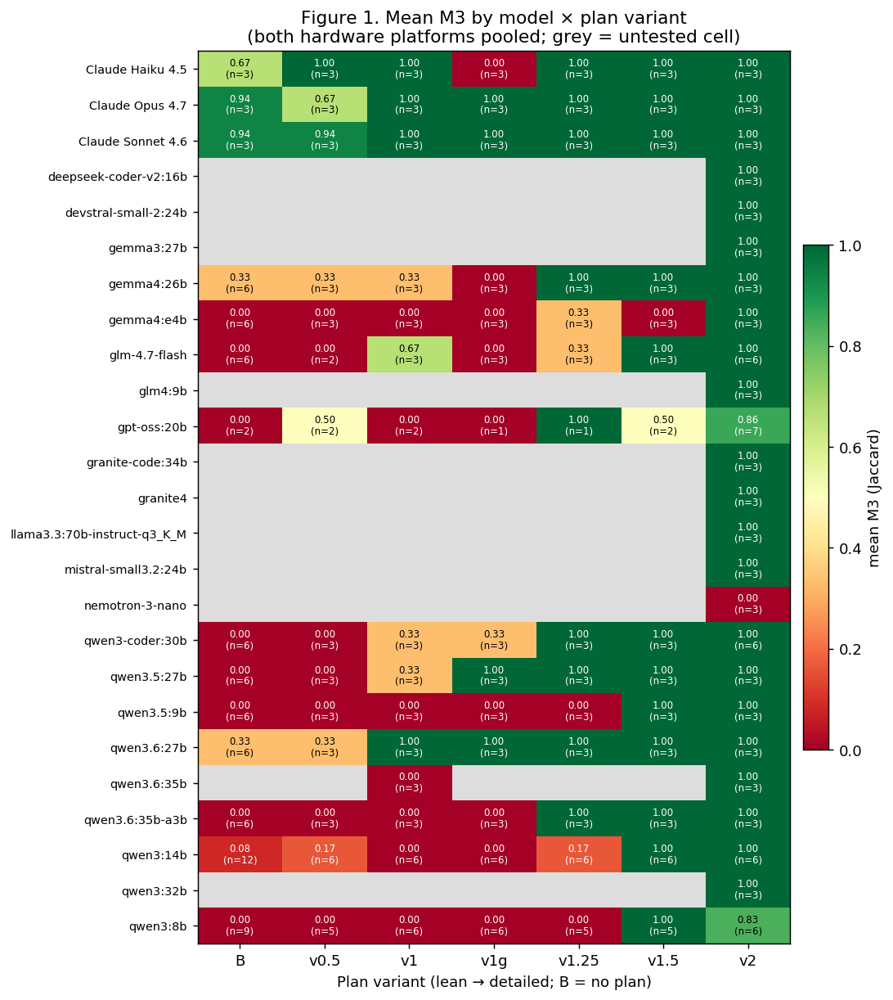
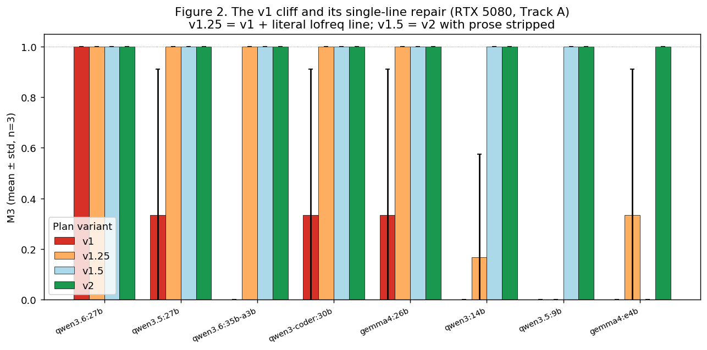
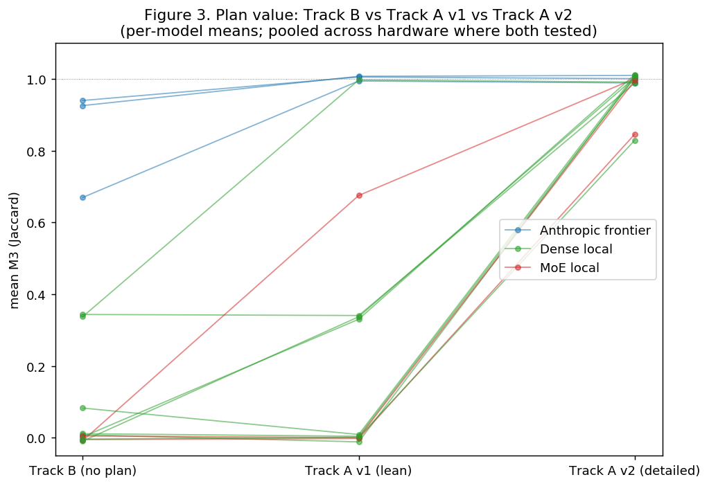
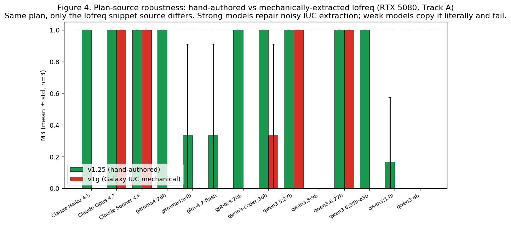
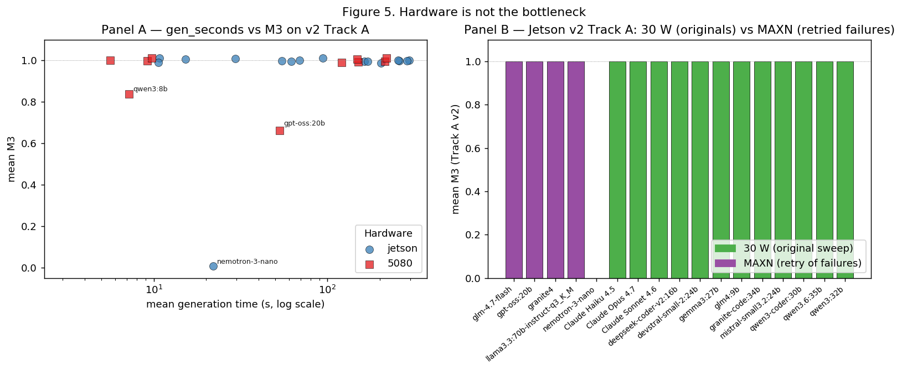
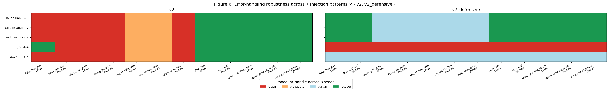

# plan-eval: a benchmark for recipe-driven bioinformatics workflow execution

A controlled comparison of frontier (Anthropic Claude 4.x) and open-weight (Ollama-hosted, 4–70 B) language models at executing an Opus-authored mtDNA variant-calling recipe, scored against a published canonical answer key. Two consumer hardware platforms (Jetson AGX Orin, RTX 5080), six plan-detail levels, two tracks (with-plan, no-plan), three seeds per cell, **n=403 scored runs**, **25 distinct models**.

## Abstract

We measure how faithfully a small or local language model converts a hyper-detailed Opus-authored recipe into an executable bioinformatics workflow, holding the substrate constant: per-sample variant calling on four paired-end mtDNA Illumina samples (Zenodo 5119008) against a published Galaxy Training Network reference workflow. Primary metric is M3, the macro-mean Jaccard index of `(chrom, pos, ref, alt)` PASS calls vs the canonical VCF, with an AF tolerance window of ±0.02. Four quantified findings: (i) plan-detail dominates model capability — going from a lean ~1200-token plan (v1) to a hyper-detailed ~1150-byte/command plan (v2) flips most local models from M3 ≈ 0.0 to 1.000 and leaves Anthropic models unchanged at 1.000; (ii) on Jetson MAXN, **13 of 14 free open-weight models score M3 = 1.000 ± 0.000 on v2 Track A**, with the smallest perfect model (`granite4`, 2.1 GB on disk) at 15 s/seed; (iii) the v1→v2 cliff for ≥27 B dense local models reduces to a single command line — adding the literal `lofreq call-parallel` invocation to v1 (variant v1.25) brings them all to 1.000, falsifying a "model size" hypothesis in favour of a "tool-CLI specificity" one; (iv) under deliberately injected tool failures (390 cells across 7 patterns × 5 models × 2 plan variants × 3 seeds), models without explicit error-handling prose (v2) collapse to identical handle-distribution profiles regardless of class — recipe alone does not produce defensive code — while explicit defensive prose (v2_defensive) cleanly separates frontier (Opus/Sonnet/Haiku, all converge to 21 recover / 14–15 partial / 0 crash) from cheap-local-but-defensive (`qwen3.6:35b`, 7/29/0 — implements the structure but recovers less often) from below-the-floor (`granite4`, 0/0/36 — cannot implement defensive scripting at all). Tracks with no plan collapse all open-weight models to M3 = 0.000 ± 0.000 while leaving frontier Anthropic at M3 ≥ 0.667. Mechanically extracting the lofreq snippet from Galaxy's IUC tool registry (variant v1g) breaks Claude Haiku and small/MoE locals because the registry's Cheetah templates produce syntactically incomplete CLIs once their runtime parameter bindings are stripped. Implication: hand-authored, command-literal plans — including, separately, command-literal *error-handling* prose — are the bottleneck for free-local recipe execution; the model class and the hardware are not.

## 1. Objective

### 1.1 Question

Can a small or local implementer model faithfully convert an Opus-authored recipe into an executable workflow, and how does this depend on recipe specificity?

### 1.2 Why mtDNA variant calling as substrate

The human mitochondrial chromosome (`chrM`, 16,569 bp) is a uniquely well-defined target for an LLM-execution benchmark:

- **Deterministic ground truth.** The dataset was published with a complete canonical workflow in the [Galaxy Training Network mitochondrial-short-variants tutorial](https://training.galaxyproject.org/training-material/topics/variant-analysis/tutorials/mitochondrial-short-variants/tutorial.html). The workflow author and the dataset author overlap with this paper's author, so the answer key is not contested.
- **Small, fast.** Four paired-end Illumina samples, ~838 KB compressed total. Each model's `run.sh` finishes in 8–17 s on either platform once the model emits a valid script.
- **Spans homoplasmic and heteroplasmic variants.** The four samples include both clean (AF ≈ 1.0) and low-frequency (AF down to ~0.04) calls, so an AF-tolerant scoring function is non-trivially exercised.
- **Toolchain is canonical and locked.** BWA-MEM → LoFreq → bcftools/SnpSift, all from a pinned bioconda environment, so model "creativity" in tool selection is constrained.

### 1.3 Why Jaccard on PASS 4-tuples as the primary metric

For each sample, the canonical and model-produced VCFs are compared as sets of 4-tuples `(chrom, pos, ref, alt)` over PASS-filtered records, with a per-call AF tolerance of ±0.02:

> M3 = mean over 4 samples of |M ∩ G| / |M ∪ G|

where M and G are the model's and the ground-truth tuple sets respectively. The metric is set-based, bounded `[0, 1]`, agnostic to caller-specific INFO/FORMAT fields, and averages cleanly across samples without weighting. It does not penalize a model for using a different but valid tool than the recipe specifies (e.g. `bcftools mpileup` instead of `lofreq`); only the *calls* are compared.

### 1.4 Recipe-then-implement framing

Workflow generation is split into two stages: a **plan** (Markdown recipe) authored once by Claude Opus 4.7, and an **implementation** (single self-contained `run.sh`) emitted by the model under test. This decomposition (a) separates planning capability from execution capability — a question that "ask Opus to do everything end-to-end" cannot answer; (b) mirrors how practitioners actually delegate (a senior writes the recipe, a junior writes the script); and (c) admits a clean no-plan control (Track B) that quantifies the marginal value of the plan.

## 2. Results

### 2.1 Plan-detail dominates model capability



The headline matrix (Figure 1) shows mean M3 across all (model × plan variant) cells, with both hardware platforms pooled. Plan variants are ordered from no-plan (Track B) on the left to most detailed (v2) on the right; intermediate columns v0.5 / v1 / v1g / v1.25 / v1.5 are defined in §4 and Table 2. The v2 column is uniformly green (M3 ≈ 1.0); the no-plan column is uniformly red except for Anthropic frontier models. Most non-frontier rows transition sharply between v1 and v2.

**Anthropic models are insensitive to plan detail on Track A.** Opus 4.7, Sonnet 4.6 and Haiku 4.5 all score M3 = 1.000 ± 0.000 (n = 3) on both v1 and v2 Track A. They have enough internal toolchain knowledge to fill in v1's ambiguities themselves.

**Local open-weight models are dominated by plan detail.** On the RTX 5080, only `qwen3.6:27b` (dense) reaches v2 levels on the lean v1 plan. All other tested open-weight models score M3 ∈ {0.000, 0.333} on v1 and 1.000 ± 0.000 on v2.

**On Jetson AGX Orin in MAXN power mode, 13 of 14 free open-weight models score M3 = 1.000 ± 0.000 on v2 Track A** (Table 1). The single failure (`nemotron-3-nano`, 24 B) is not a plan-detail or budget issue but a code-correctness bug: the model emits a script in 22 s that calls `bgzip results/${sample}.vcf` before `lofreq` has produced the file, exits 255 in 8 s. A second model (`olmo-3.1:32b`) is excluded from the n=14 count above because its three seeds time out at the 900 s wall budget — a real reasoning-mode failure that does not respect Ollama's `/no_think`.

### 2.2 The v1 cliff reduces to one missing command line



The v1→v2 transition adds ≈1500 bytes of prose and code fences. Two intermediate plan variants isolate which part of that delta carries the load (Figure 2, RTX 5080, Track A, n = 3 per cell):

- **v1.25** = v1 + one extra code-fenced line, the literal `lofreq call-parallel --pp-threads $T -f $REF -o $OUT $BAM` invocation.
- **v1.5** = v2 with every prose paragraph and "Gotchas" subsection stripped — only numbered headings and code fences remain.

For ≥27 B dense models (qwen3.5:27b, qwen3.6:35b-a3b, qwen3-coder:30b, gemma4:26b) **v1.25 alone is sufficient** to bring M3 to 1.000 ± 0.000. The only tool whose CLI these models could not reconstruct from prose is `lofreq`, whose BAM is positional and not flagged. Smaller models (≤14 B, including qwen3:14b, qwen3.5:9b, qwen3:8b, gemma4:e4b) require **every** command line to be literalized; v1.5 brings them to 1.000 while v1.25 leaves them at 0.000–0.333.

The prose paragraphs in v2 — read-group escape-character warnings, in-place bgzip notes, format-string conventions — are not load-bearing for the implementer model. v1.5 omits all of them and produces equivalent M3 to v2 on the models that pass v2 at all. The variants are summarized in Table 2.

### 2.3 No-plan tracks isolate plan value from model capability



Track B presents only the problem statement and a tool inventory — no recipe — to the model. Across all tested open-weight models on Track B (any plan-version), mean M3 is 0.000 ± 0.000 with two exceptions: a single 1/3 fluke for `qwen3_14b` (mean 0.17) and an isolated 1/3 for `gemma4:26b` (mean 0.33). Anthropic Opus 4.7 and Sonnet 4.6 reach 0.94 ± 0.00 on Track B; Haiku 4.5 reaches 0.67 ± 0.58 (one of three runs returns zero correct variants, instability without the recipe).

The slope plot (Figure 3) makes the inversion explicit: the open-weight curve is essentially flat at zero through Track B and Track A v1, then jumps to 1.0 at Track A v2. The Anthropic curve is flat near 1.0 across all three points. **The plan is not a productivity hack for local models; it is a capability prerequisite.**

A control (variant v0.5 = Track B + a sequence of tool names with no flags or commands) shows that telling local models *what* to do without specifying *how* is operationally identical to giving them nothing: M3 stays at 0.000 ± 0.000 across all 11 RTX 5080 models tested.

### 2.4 Mechanically extracted plans degrade weak models more than strong ones



If the v1.25 result reduces the v1 cliff to a single command line, a natural follow-up is whether that command line must be human-authored. Galaxy's IUC tool collection (`galaxyproject/tools-iuc`) is a community-curated registry of XML wrappers, one per tool, with `<command><![CDATA[...]]></command>` blocks that — after Cheetah templating substitution at Galaxy runtime — produce the canonical CLI invocation each tool expects.

We replaced the hand-authored lofreq snippet in v1.25 with a snippet mechanically extracted from `tools-iuc` commit `39e7456` by `scripts/galaxy_to_snippet.py` (Cheetah-strip + macro expansion + path substitution) — call this v1g. Galaxy's lofreq XML emits `--sig $value` and `--bonf $value` where `$value` is supplied at Galaxy runtime; Cheetah strips the variables, so the bare flags `--sig` and `--bonf` end up in the snippet on adjacent lines. lofreq then reads `--sig --bonf` as `--sig=--bonf`, attempts `float("--bonf")`, and exits with `ValueError`.

Figure 4 splits the test pool by self-correction capacity. Claude Opus 4.7, Claude Sonnet 4.6, qwen3.5:27b dense, qwen3.6:27b dense, and qwen3-coder:30b recognize the malformed bare flags and drop them before emitting the script — M3 stays at 1.000. Claude Haiku 4.5, qwen3.6:35b-a3b MoE, gemma4:26b, gemma4:e4b, glm-4.7-flash, and the small qwen3 models copy the snippet character-for-character and ship a script that lofreq refuses to parse — M3 drops to 0.000 ± 0.000. **Haiku regresses from M3 = 1.000 ± 0.000 on v1.25 (hand) to M3 = 0.000 ± 0.000 on v1g (IUC) with no other change.**

The Galaxy-IUC wrappers are Galaxy-runtime templates rather than self-contained CLIs. Without per-tool default-value substitution at extraction time, a deterministic transpiler cannot replace a human plan author for cheaper open-weight models. Strong models can repair noisy registry output; weak models cannot.

### 2.5 Hardware is not the bottleneck



Figure 5 Panel A plots mean generation time (log scale) against mean M3 for each (model × hardware) cell on v2 Track A. The Jetson AGX Orin and the RTX 5080 produce indistinguishable M3 distributions; the only sub-1.0 outliers are model-specific (`gpt-oss:20b` Harmony reasoning eating output budget, `qwen3:8b` minimum-size effects, `nemotron-3-nano`'s scripting bug). The 5080 is faster (typical 5–60 s/seed for the Group A in-VRAM models) than the Jetson (typical 15–300 s/seed), but does not score higher.

Panel B shows the Jetson sweep at 30 W power mode (original 9-of-14 perfect, green) versus MAXN (the 5 originally-failing entries retried, purple). Four of the five MAXN retries reach M3 = 1.000; only `olmo-3.1:32b` remains a real reasoning-mode timeout (excluded from the bar chart because all three of its seeds at MAXN exceed the 900 s budget and produce no run dirs). The Jetson 30 W → MAXN delta is a budget-constrained timeout effect, not a capability one. A latent harness bug — discussed in §3.3 — additionally accounts for three of the original "timeouts" being misroutes rather than real budget failures.

### 2.6 Error-handling robustness under deliberately injected tool failures

§2.1–§2.5 measured implementer behaviour on the happy path. To probe what happens when a tool actually misbehaves at runtime, we ran a second matrix of 390 runs (5 models × 7 injection patterns × 1–2 target tools × 2 recipe variants × 3 seeds) in which one of `bwa` or `lofreq` is shimmed by a Python wrapper that simulates a controlled failure mode. The shim sits ahead of the real tool on `PATH` and reads `EVAL_INJECT_PATTERN` and `EVAL_INJECT_TARGET` to decide its behaviour; the model's own `run.sh` is unchanged across cells.

Seven failure patterns:

| pattern | what the shim does | imitates |
|---|---|---|
| `flake_first_call` | first invocation exits 1, subsequent succeed | transient I/O hiccup |
| `one_sample_fails` | exits 1 only when `M117C1-ch` appears in args | one corrupt sample in a batch |
| `silent_truncation` | runs the real tool, then truncates the `-o` output to 0 bytes | broken disk write the tool didn't notice |
| `stderr_warning_storm` | spews 200 `WARNING` lines on stderr, then runs the real tool | false-alarm noise (samtools-view oddities) |
| `slow_tool` | sleeps 30 s, then runs the real tool | overloaded I/O |
| `wrong_format_output` | runs the real tool, then strips every variant line from the output VCF | broken caller config that produces no calls |
| `missing_lib_error` | exits 127 with `error while loading shared libraries: libhts.so.3` | broken conda env, stale cache |

Two recipe variants are crossed with the patterns: **v2** (the existing happy-path detailed plan, no error-handling prose) and **v2_defensive** (a new Opus-authored plan, `plan/PLAN_v2_defensive.md`, that requires a `try()` helper, output-validation after every step, retry-once on failure, per-sample isolation via `continue`, structured `results/failures.log` rows, and a stderr summary line). Five representative implementer models: Claude Opus 4.7 / Sonnet 4.6 / Haiku 4.5, plus open-weight `qwen3.6:35b` (Jetson MAXN) and `granite4` (the smallest passer of §2.1). Three new metrics on top of M3: **`m_handle`** (categorical: `crash` / `propagate` / `partial` / `recover`), **`m_recover`** (binary; was the n_valid_VCF count equal to the *best-achievable* count for this pattern?), **`m_diagnose`** (binary; was failure structurally logged or summarised?). Definitions are in §3.3 and the metric code is `score/score_run.py:error_handling`.



**v2 is identical across models.** Without defensive prose, all five models — frontier and local — collapse to the same modal handle distribution per pattern. The four left-panel rows of Figure 6 are visually identical: red on `flake_first_call`, `missing_lib_error`, `silent_truncation`; orange (`propagate`) on `one_sample_fails`; green (`recover`) on `slow_tool`, `stderr_warning_storm`, `wrong_format_output`. Numerically the per-(model, plan) handle counts on v2 are exactly **15 recover / 0 partial / 6 propagate / 15 crash (n=36)** for Opus, Sonnet, Haiku, and qwen3.6:35b. Granite4 lands at 12 / 0 / 4 / 20 — slightly more crashes from a small-model artifact (it sometimes fails to emit a parseable script even on `slow_tool`). The takeaway: **without explicit error-handling instructions, the recipe alone does not produce defensive code, regardless of implementer model class.** Models inherit only the failure modes that follow from `set -euo pipefail` plus naive sequential execution.

**v2_defensive separates frontier from local cleanly.**

- The **three Anthropic models converge again**, but at a much better point: 21 recover / 14–15 partial / 0 propagate / 0–1 crash (n=36 each). They all implement Opus's `try()` helper faithfully, retry transient failures, isolate per-sample failures, and never let a tool error abort the whole script.
- **`qwen3.6:35b`** drops to **7 recover / 29 partial / 0 propagate / 0 crash**. The defensive script is structurally correct — zero crashes — but its retries and recovery loops succeed on a smaller fraction of cells than Anthropic. Per-pattern mean M3 reflects this: `flake_first_call` 0.33, `one_sample_fails` 0.25, `stderr_warning_storm` 0.33 — versus Opus's 1.00 / 0.75 / 1.00. qwen detects errors and skips, but doesn't always recover even when recovery is possible.
- **`granite4` cannot implement v2_defensive at all**: every single cell is `crash` (36/36, all M3=0). Its 2.1 GB capacity is enough to transliterate the v2 plan into bash but not enough to faithfully implement the v2_defensive `try()` helper plus per-sample loop continuation. This is a model-capability floor for defensive scripting, well below the threshold for happy-path scripting.

**The pattern character matters as much as the model.** Three patterns are catastrophic in principle and remain so under v2_defensive: `missing_lib_error` cannot be recovered (the workflow can't proceed without `libhts.so.3`); `silent_truncation` and `wrong_format_output` produce content that is structurally valid but biologically empty, and a model can at best detect-and-skip rather than recover. By contrast `flake_first_call`, `slow_tool`, `stderr_warning_storm`, and `one_sample_fails` are fully recoverable in the sense that an aware script (a) retries, (b) waits, (c) ignores noise, or (d) skips the bad sample. The dichotomy isn't model-driven; it's pattern-driven, and §3.3's `m_recover` (binary best-achievable) captures it explicitly.

**Diagnostic-quality results.** `m_diagnose` (whether the script populated `failures.log` or emitted a structured summary) is 0 across every v2 cell (no model writes a failures log without instructions) and is ≥0.85 across every v2_defensive cell except the 4 patterns that exit before any user code runs (`missing_lib_error` exits 127 immediately during reference indexing). For the recoverable patterns the v2_defensive Anthropic cells diagnose with `m_diagnose=1` on every seed.

**Caveats.** `m_handle="recover"` does not mean the output is biologically correct — it means n_valid_VCF=4. For `wrong_format_output`, every Anthropic v2_defensive run scores `recover` while M3=0: the script ships four header-only VCFs that pass `bcftools view -h` but contain no calls. Detecting an empty-but-structurally-valid file would require an explicit content check (e.g. `bcftools view -H | wc -l > 0`) the v2_defensive plan does not require. This is a real gap in the prose, not a model failure, and is the single most informative caveat the experiment surfaces about defensive-recipe design.

The headline (model, plan) summary is reproduced verbatim from the matrix log:

| model / plan | recover | partial | propagate | crash | n |
|---|---:|---:|---:|---:|---:|
| Claude Opus 4.7 / v2 | 15 | 0 | 6 | 15 | 36 |
| Claude Opus 4.7 / v2_defensive | 21 | 15 | 0 | 0 | 36 |
| Claude Sonnet 4.6 / v2 | 15 | 0 | 6 | 15 | 36 |
| Claude Sonnet 4.6 / v2_defensive | 21 | 14 | 0 | 1 | 36 |
| Claude Haiku 4.5 / v2 | 15 | 0 | 6 | 15 | 36 |
| Claude Haiku 4.5 / v2_defensive | 21 | 15 | 0 | 0 | 36 |
| qwen3.6:35b / v2 | 15 | 0 | 6 | 15 | 36 |
| qwen3.6:35b / v2_defensive | 7 | 29 | 0 | 0 | 36 |
| granite4 / v2 | 12 | 0 | 4 | 20 | 36 |
| granite4 / v2_defensive | 0 | 0 | 0 | 36 | 36 |

n=36 = 12 (pattern, tool) cells × 3 seeds; baseline (no-injection) cells excluded.

### Table 1 — Headline results

| model | v2 Track A M3 | v1 Track A M3 | Track B M3 | mean v2 gen (s) | M5 pass |
|---|---:|---:|---:|---:|---:|
| Claude Opus 4.7 | 1.00±0.00 (n=3) | 1.00±0.00 (n=3) | 0.94±0.00 (n=3) | 11 | 100% |
| Claude Sonnet 4.6 | 1.00±0.00 (n=3) | 1.00±0.00 (n=3) | 0.94±0.00 (n=3) | 11 | 100% |
| Claude Haiku 4.5 | 1.00±0.00 (n=3) | 1.00±0.00 (n=3) | 0.67±0.58 (n=3) | 69 | 100% |
| `qwen3.6:27b` (dense) | 1.00±0.00 (n=3) | 1.00±0.00 (n=3) | 0.33±0.58 (n=3) | 219 | 100% |
| `qwen3.6:35b` (dense) | 1.00±0.00 (n=3) | 0.00±0.00 (n=3) | — | 100 | 100% |
| `qwen3:32b` | 1.00±0.00 (n=3) | — | — | 286 | 100% |
| `qwen3:14b` | 1.00±0.00 (n=6) | 0.00±0.00 (n=6) | 0.17±0.41 (n=6) | 10 | 33% |
| `qwen3-coder:30b` | 1.00±0.00 (n=3) | 0.33±0.58 (n=3) | 0.00±0.00 (n=3) | 105 | 0% |
| `qwen3.5:27b` | 1.00±0.00 (n=3) | 0.33±0.58 (n=3) | 0.00±0.00 (n=3) | 214 | 100% |
| `qwen3.5:9b` | 1.00±0.00 (n=3) | 0.00±0.00 (n=3) | 0.00±0.00 (n=3) | 6 | 100% |
| `qwen3:8b` | 0.83±0.41 (n=6) | 0.00±0.00 (n=6) | 0.00±0.00 (n=5) | 7 | 0% |
| `qwen3.6:35b-a3b` (MoE) | 1.00±0.00 (n=3) | 0.00±0.00 (n=3) | 0.00±0.00 (n=3) | 127 | 100% |
| `gemma3:27b` | 1.00±0.00 (n=3) | — | — | 259 | 0% |
| `gemma4:26b` | 1.00±0.00 (n=3) | 0.33±0.58 (n=3) | 0.33±0.58 (n=3) | 121 | 100% |
| `gemma4:e4b` | 1.00±0.00 (n=3) | 0.00±0.00 (n=3) | 0.00±0.00 (n=3) | 9 | 100% |
| `mistral-small3.2:24b` | 1.00±0.00 (n=3) | — | — | 170 | 100% |
| `devstral-small-2:24b` | 1.00±0.00 (n=3) | — | — | 163 | 0% |
| `granite-code:34b` | 1.00±0.00 (n=3) | — | — | 203 | 33% |
| `granite4` | 1.00±0.00 (n=3) | — | — | 15 | 100% |
| `deepseek-coder-v2:16b` (MoE) | 1.00±0.00 (n=3) | — | — | 94 | 100% |
| `glm4:9b` | 1.00±0.00 (n=3) | — | — | 55 | 33% |
| `glm-4.7-flash` (MoE) | 1.00±0.00 (n=3) | 0.67±0.58 (n=3) | 0.00±0.00 (n=3) | 90 | 50% |
| `gpt-oss:20b` (MoE) | 0.67±0.58 (n=3) | 0.00±0.00 (n=2) | 0.00 (n=1) | 174 | 83% |
| `llama3.3:70b-instruct-q3_K_M` | 1.00±0.00 (n=3) | — | — | 255 | 100% |
| `nemotron-3-nano` (24 B) | 0.00±0.00 (n=3) | — | — | 22 | 0% |
| `olmo-3.1:32b` | timeout (n=3, ≥900 s) | — | — | — | — |

Mean v2 generation seconds are computed over seeds 42/43/44 of the (model × v2) cell on whichever hardware the model was tested. M5 pass is the fraction of v2 Track A runs satisfying all five script-quality flags (§4). Where a model is untested at a given (plan, track) cell the entry is "—". M3 standard deviations are computed over the n seeds in each cell; cells with `±0.58` reflect the inevitable n=3 std of a {0, 0, 1} or {1, 1, 0} pattern.

### Table 2 — Plan variants

| variant | file | bytes | derivation | hypothesis tested |
|---|---|---:|---|---|
| **Track B** | (no plan) | 0 | problem statement + tool inventory only | how much of the workflow can the model recover from internal knowledge alone? |
| v0.5 | `prompts/track_b_with_order_user.tmpl` | 1361 | Track B + a single line giving the tool order (no flags, no commands) | does sequencing without syntax help local models? |
| v1 (lean) | `plan/PLAN_v1.md` | 3118 | Opus 4.7 from `PLANNER_PROMPT.md`: numbered bullets naming tools and key flags | baseline lean plan |
| v1.25 | `plan/PLAN_v1p25.md` | 3080 | v1 + the exact `lofreq call-parallel` command line | is the v1→v2 cliff explained by a single tool's CLI? |
| v1.5 | `plan/PLAN_v1p5.md` | 1277 | v2 with every prose paragraph and "Gotchas" block deleted, code fences kept | are the prose explanations in v2 load-bearing or decorative? |
| v1g | `plan/PLAN_v1g.md` | 4187 | v1 + Galaxy-IUC-mechanical lofreq snippet (Cheetah-strip + macro expand from `tools-iuc@39e7456`) | can a tool registry replace a human plan author? |
| v2 (detailed) | `plan/PLAN.md` | 4617 | Opus 4.7 from `PLANNER_PROMPT_v2.md`: every step gives the exact command line | reference detailed plan |
| v2_defensive | `plan/PLAN_v2_defensive.md` | 6523 | Opus 4.7 from `PLANNER_PROMPT_v2_defensive.md`: v2 plus a `try()` helper, output-validation after every step, retry-once, per-sample isolation, structured failure log, exit policy | does explicit error-handling prose make implementer scripts defensive against runtime tool failures? (§2.6) |

### Table 3 — Failure taxonomy on v2 Track A (cells with mean M3 < 1.0)

| model | hardware | n | mean M3 | M1 pass | root cause |
|---|---|---:|---:|---:|---|
| `nemotron-3-nano` | Jetson | 3 | 0.000±0.000 | 0/3 | command-ordering bug: script calls `bgzip results/${sample}.vcf` before lofreq has produced the file; exits 255 in 8 s |
| `gpt-oss:20b` | RTX 5080 | 3 | 0.667±0.577 | varies | Harmony chain-of-thought consumes the 16384-token output budget before the script is emitted (~50% of cells) |
| `qwen3:8b` | RTX 5080 | 6 | 0.833±0.408 | varies | smallest model in the lineup; near the capability floor for v2 (1/6 cells emits an empty script) |
| `olmo-3.1:32b` | Jetson | 3 | timeout | — | reasoning-mode model; 902 s × 3 seeds at MAXN, exceeds 900 s wall budget; does not respect Ollama `/no_think` |

Three of the four failures are independent of the plan-detail axis. Two are reasoning-mode budget exhaustions (one wall-clock, one token-budget); one is a script-correctness bug in code that runs to completion. Only the script-correctness case is what most readers expect a "failure" in this benchmark to look like.

### Plan variants — full text

The six plan variants in Table 2 are reproduced verbatim below. The Markdown body shown is exactly what is concatenated into the per-track user prompt (see §3.2) before sending to the implementer model — no further preprocessing.

<details>
<summary><b>v1 (lean)</b> — <code>plan/PLAN_v1.md</code>, 3118 bytes</summary>

```markdown
# Per-sample mtDNA amplicon variant-calling plan

1. **Set globals and prepare results directory**
   - Define `THREADS=4` and the sample list: `M117-bl M117-ch M117C1-bl M117C1-ch`.
   - Create `results/` if missing. Use `set -euo pipefail`.
   - Treat every output step as idempotent: guard each artifact with an existence check (e.g. skip if `results/{sample}.vcf.gz.tbi` already exists and is newer than its inputs). Re-runs on a fully populated `results/` must exit 0 without re-doing work.

2. **Reference indexing (once, in `data/ref/`)**
   - `samtools faidx data/ref/chrM.fa` → produces `chrM.fa.fai`.
   - `bwa index data/ref/chrM.fa` → produces the `.amb .ann .bwt .pac .sa` set.
   - Skip both if the index files already exist.

3. **Per-sample alignment with `bwa mem`**
   - Use `bwa mem -t 4` with the paired FASTQs `data/raw/{sample}_1.fq.gz` and `data/raw/{sample}_2.fq.gz`.
   - Pass the read group via `-R` as a single double-quoted argument containing literal backslash-t between fields and colons between key and value:
     - exact form: `-R "@RG\tID:{sample}\tSM:{sample}\tLB:{sample}\tPL:ILLUMINA"`
     - The `\t` must remain the two characters backslash and `t` — bwa parses them itself. Do NOT use `printf`, `echo -e`, `$'\t'`, or any mechanism that turns them into real tabs; bwa rejects real tabs with "the read group line contained literal <tab> characters".
     - Separators between key and value are colons `:`, not `=`.

4. **SAM → sorted BAM**
   - Pipe `bwa mem` stdout into `samtools sort -@ 4 -o results/{sample}.bam`.
   - Do NOT run `markdup` or `rmdup`: this is amplicon data where PCR duplicates are expected and biologically meaningful.

5. **BAM indexing**
   - `samtools index -@ 4 results/{sample}.bam` → `results/{sample}.bam.bai`.

6. **Variant calling with `lofreq call-parallel`**
   - Use the `call-parallel` subcommand (not plain `lofreq call`) with `--pp-threads 4`.
   - Reference: `data/ref/chrM.fa`. Input: `results/{sample}.bam`.
   - Write uncompressed VCF to a temporary path (e.g. `results/{sample}.vcf`); lofreq emits plain VCF.

7. **VCF compression and indexing**
   - Compress with `bgzip` (not `bcftools view -O z`) producing `results/{sample}.vcf.gz`.
   - Index with `tabix -p vcf results/{sample}.vcf.gz` → `results/{sample}.vcf.gz.tbi`.
   - Remove the intermediate uncompressed `.vcf`.

8. **Collapse step → `results/collapsed.tsv`**
   - For each sample, run `bcftools query -f '{sample}\t%CHROM\t%POS\t%REF\t%ALT\t%INFO/AF\n' results/{sample}.vcf.gz` (the `{sample}` literal is prepended via the format string so the sample name is attached per row).
   - Concatenate all four samples' output.
   - Prepend a single header line `sample\tchrom\tpos\tref\talt\taf` (tab-separated).
   - Output is tab-separated, one variant per line, header on, written to `results/collapsed.tsv`. Rebuild only if any input VCF is newer than the TSV.

9. **Idempotency check**
   - Final pass: re-running the script on a fully populated `results/` exits 0, performs no work, and leaves all eight per-sample artifacts plus `collapsed.tsv` intact.
```

</details>

<details>
<summary><b>v1.25</b> — <code>plan/PLAN_v1p25.md</code>, 3080 bytes (delta from v1: step 6 gains a literal <code>lofreq call-parallel</code> command line)</summary>

````markdown
# Per-sample mtDNA amplicon variant-calling plan

1. **Set globals and prepare results directory**
   - Define `THREADS=4` and the sample list: `M117-bl M117-ch M117C1-bl M117C1-ch`.
   - Create `results/` if missing. Use `set -euo pipefail`.
   - Treat every output step as idempotent: guard each artifact with an existence check (e.g. skip if `results/{sample}.vcf.gz.tbi` already exists and is newer than its inputs). Re-runs on a fully populated `results/` must exit 0 without re-doing work.

2. **Reference indexing (once, in `data/ref/`)**
   - `samtools faidx data/ref/chrM.fa` → produces `chrM.fa.fai`.
   - `bwa index data/ref/chrM.fa` → produces the `.amb .ann .bwt .pac .sa` set.
   - Skip both if the index files already exist.

3. **Per-sample alignment with `bwa mem`**
   - Use `bwa mem -t 4` with the paired FASTQs `data/raw/{sample}_1.fq.gz` and `data/raw/{sample}_2.fq.gz`.
   - Pass the read group via `-R` as a single double-quoted argument containing literal backslash-t between fields and colons between key and value:
     - exact form: `-R "@RG\tID:{sample}\tSM:{sample}\tLB:{sample}\tPL:ILLUMINA"`
     - The `\t` must remain the two characters backslash and `t` — bwa parses them itself. Do NOT use `printf`, `echo -e`, `$'\t'`, or any mechanism that turns them into real tabs; bwa rejects real tabs with "the read group line contained literal <tab> characters".
     - Separators between key and value are colons `:`, not `=`.

4. **SAM → sorted BAM**
   - Pipe `bwa mem` stdout into `samtools sort -@ 4 -o results/{sample}.bam`.
   - Do NOT run `markdup` or `rmdup`: this is amplicon data where PCR duplicates are expected and biologically meaningful.

5. **BAM indexing**
   - `samtools index -@ 4 results/{sample}.bam` → `results/{sample}.bam.bai`.

6. **Variant calling with `lofreq call-parallel`**
   - Exact command:
     ```
     lofreq call-parallel --pp-threads 4 -f data/ref/chrM.fa -o results/{sample}.vcf results/{sample}.bam
     ```
   - Output: `results/{sample}.vcf` (uncompressed). lofreq emits plain VCF.

7. **VCF compression and indexing**
   - Compress with `bgzip` (not `bcftools view -O z`) producing `results/{sample}.vcf.gz`.
   - Index with `tabix -p vcf results/{sample}.vcf.gz` → `results/{sample}.vcf.gz.tbi`.
   - Remove the intermediate uncompressed `.vcf`.

8. **Collapse step → `results/collapsed.tsv`**
   - For each sample, run `bcftools query -f '{sample}\t%CHROM\t%POS\t%REF\t%ALT\t%INFO/AF\n' results/{sample}.vcf.gz` (the `{sample}` literal is prepended via the format string so the sample name is attached per row).
   - Concatenate all four samples' output.
   - Prepend a single header line `sample\tchrom\tpos\tref\talt\taf` (tab-separated).
   - Output is tab-separated, one variant per line, header on, written to `results/collapsed.tsv`. Rebuild only if any input VCF is newer than the TSV.

9. **Idempotency check**
   - Final pass: re-running the script on a fully populated `results/` exits 0, performs no work, and leaves all eight per-sample artifacts plus `collapsed.tsv` intact.
````

</details>

<details>
<summary><b>v1.5</b> — <code>plan/PLAN_v1p5.md</code>, 1277 bytes (v2 with every prose paragraph and "Gotchas" subsection deleted; only headings + code fences)</summary>

````markdown
# Implementation Plan: Per-sample mtDNA Variant Calling

## Boilerplate (top of `run.sh`)

```
set -euo pipefail
THREADS=4
SAMPLES=("M117-bl" "M117-ch" "M117C1-bl" "M117C1-ch")
mkdir -p results
```

All per-sample steps run in `for sample in "${SAMPLES[@]}"; do ... done`.

---

## 1. Reference indexing — BWA

```
bwa index data/ref/chrM.fa
```

## 2. Reference indexing — samtools faidx

```
samtools faidx data/ref/chrM.fa
```

## 3. Per-sample alignment + sort (one pipeline)

```
bwa mem -t 4 -R "@RG\tID:{sample}\tSM:{sample}\tLB:{sample}\tPL:ILLUMINA" data/ref/chrM.fa data/raw/{sample}_1.fq.gz data/raw/{sample}_2.fq.gz | samtools sort -@ 4 -o results/{sample}.bam -
```

## 4. BAM index

```
samtools index -@ 4 results/{sample}.bam
```

## 5. Variant calling — LoFreq

```
lofreq call-parallel --pp-threads 4 -f data/ref/chrM.fa -o results/{sample}.vcf results/{sample}.bam
```

## 6. VCF compression + tabix index

```
bgzip -f results/{sample}.vcf
```
```
tabix -p vcf results/{sample}.vcf.gz
```

## 7. Collapsed TSV

```
printf 'sample\tchrom\tpos\tref\talt\taf\n' > results/collapsed.tsv
```
```
bcftools query -f '%CHROM\t%POS\t%REF\t%ALT\t%INFO/AF\n' results/{sample}.vcf.gz | awk -v s={sample} 'BEGIN{OFS="\t"}{print s,$0}' >> results/collapsed.tsv
```
````

</details>

<details>
<summary><b>v1g</b> — <code>plan/PLAN_v1g.md</code>, 4187 bytes (v1 with the lofreq snippet replaced by a mechanical extract from <code>tools-iuc@39e7456</code>)</summary>

````markdown
# Per-sample mtDNA amplicon variant-calling plan
<!--
v1g = v1 with Galaxy-IUC-derived CLI snippets injected per step where IUC has
clean coverage. Extracted mechanically by scripts/galaxy_to_snippet.py from
tools-iuc commit 39e745658a6ff7f013788871916574117a0f47f1 (2026-04-27).

IUC coverage map:
  bwa, bwa-mem        : extraction yields mostly noise (heavy macro use) — fallback to v1 prose
  samtools_faidx       : all-conditional command block — fallback to v1 prose
  samtools_sort        : partial extraction with placeholders — fallback to v1 prose
  samtools_index       : not in IUC — fallback to v1 prose
  lofreq_call_parallel : clean extraction — INJECTED (step 6)
  bgzip / tabix        : not in IUC — fallback to v1 prose
  bcftools_query       : format string in stripped Cheetah var — fallback to v1 prose
-->

1. **Set globals and prepare results directory**
   - Define `THREADS=4` and the sample list: `M117-bl M117-ch M117C1-bl M117C1-ch`.
   - Create `results/` if missing. Use `set -euo pipefail`.
   - Treat every output step as idempotent: guard each artifact with an existence check (e.g. skip if `results/{sample}.vcf.gz.tbi` already exists and is newer than its inputs). Re-runs on a fully populated `results/` must exit 0 without re-doing work.

2. **Reference indexing (once, in `data/ref/`)**
   - `samtools faidx data/ref/chrM.fa` → produces `chrM.fa.fai`.
   - `bwa index data/ref/chrM.fa` → produces the `.amb .ann .bwt .pac .sa` set.
   - Skip both if the index files already exist.

3. **Per-sample alignment with `bwa mem`**
   - Use `bwa mem -t 4` with the paired FASTQs `data/raw/{sample}_1.fq.gz` and `data/raw/{sample}_2.fq.gz`.
   - Pass the read group via `-R` as a single double-quoted argument containing literal backslash-t between fields and colons between key and value:
     - exact form: `-R "@RG\tID:{sample}\tSM:{sample}\tLB:{sample}\tPL:ILLUMINA"`
     - The `\t` must remain the two characters backslash and `t` — bwa parses them itself. Do NOT use `printf`, `echo -e`, `$'\t'`, or any mechanism that turns them into real tabs; bwa rejects real tabs with "the read group line contained literal <tab> characters".
     - Separators between key and value are colons `:`, not `=`.

4. **SAM → sorted BAM**
   - Pipe `bwa mem` stdout into `samtools sort -@ 4 -o results/{sample}.bam`.
   - Do NOT run `markdup` or `rmdup`: this is amplicon data where PCR duplicates are expected and biologically meaningful.

5. **BAM indexing**
   - `samtools index -@ 4 results/{sample}.bam` → `results/{sample}.bam.bai`.

6. **Variant calling with `lofreq call-parallel`**
   - Galaxy IUC canonical invocation (extracted from `tools/lofreq/lofreq_call.xml` @ tools-iuc 39e7456):
     ```
     lofreq call-parallel --pp-threads 4 --verbose
     --ref data/ref/chrM.fa --out results/{sample}.vcf
     --sig
     --bonf
     results/{sample}.bam
     ```
     (The bare `--sig` and `--bonf` lines come from Galaxy-runtime-supplied values; you can omit them and use lofreq's defaults. The load-bearing detail is that `results/{sample}.bam` is a **positional argument at the end**, not behind `-i`/`-b`/`-bam`.)

7. **VCF compression and indexing**
   - Compress with `bgzip` (not `bcftools view -O z`) producing `results/{sample}.vcf.gz`.
   - Index with `tabix -p vcf results/{sample}.vcf.gz` → `results/{sample}.vcf.gz.tbi`.
   - Remove the intermediate uncompressed `.vcf`.

8. **Collapse step → `results/collapsed.tsv`**
   - For each sample, run `bcftools query -f '{sample}\t%CHROM\t%POS\t%REF\t%ALT\t%INFO/AF\n' results/{sample}.vcf.gz` (the `{sample}` literal is prepended via the format string so the sample name is attached per row).
   - Concatenate all four samples' output.
   - Prepend a single header line `sample\tchrom\tpos\tref\talt\taf` (tab-separated).
   - Output is tab-separated, one variant per line, header on, written to `results/collapsed.tsv`. Rebuild only if any input VCF is newer than the TSV.

9. **Idempotency check**
   - Final pass: re-running the script on a fully populated `results/` exits 0, performs no work, and leaves all eight per-sample artifacts plus `collapsed.tsv` intact.
````

The bare `--sig` / `--bonf` lines in step 6 are the bug discussed in §2.4: Galaxy's Cheetah templating strips the runtime-supplied `$value` after each flag, leaving the bare flag on its own line. lofreq then parses `--sig --bonf` as `--sig=--bonf`, attempts `float("--bonf")`, and dies. Strong models drop both flags before emitting their script; weaker models copy the snippet character-for-character.

</details>

<details>
<summary><b>v2 (detailed)</b> — <code>plan/PLAN.md</code>, 4617 bytes</summary>

````markdown
# Implementation Plan: Per-sample mtDNA Variant Calling

## Boilerplate (top of `run.sh`)
- First line after shebang: `set -euo pipefail`.
- Constants: `THREADS=4` and `SAMPLES=("M117-bl" "M117-ch" "M117C1-bl" "M117C1-ch")`.
- Create output dir: `mkdir -p results`.
- All per-sample steps must be wrapped in `for sample in "${SAMPLES[@]}"; do ... done`.

---

## 1. Reference indexing — BWA

```
bwa index data/ref/chrM.fa
```

- Outputs (5 sibling files): `data/ref/chrM.fa.amb`, `.ann`, `.bwt`, `.pac`, `.sa`.
- Idempotency guard: `[[ -f data/ref/chrM.fa.bwt ]] || bwa index data/ref/chrM.fa`
- Gotcha: `bwa index` writes outputs next to the input; the dir must be writable. No flags needed for a 16 kb reference (default algorithm is fine).

## 2. Reference indexing — samtools faidx

```
samtools faidx data/ref/chrM.fa
```

- Output: `data/ref/chrM.fa.fai`.
- Guard: `[[ -f data/ref/chrM.fa.fai ]] || samtools faidx data/ref/chrM.fa`

## 3. Per-sample alignment + sort (one pipeline)

```
bwa mem -t 4 -R "@RG\tID:{sample}\tSM:{sample}\tLB:{sample}\tPL:ILLUMINA" data/ref/chrM.fa data/raw/{sample}_1.fq.gz data/raw/{sample}_2.fq.gz | samtools sort -@ 4 -o results/{sample}.bam -
```

- Output: `results/{sample}.bam`.
- Guard: `[[ -f results/{sample}.bam ]] || { bwa mem ... | samtools sort ... ; }` — wrap the whole pipeline in braces so the guard covers both stages.
- RG string gotchas (CRITICAL):
  - Use colons (`ID:`, `SM:`, `LB:`, `PL:`) — never `=`.
  - Use the **literal two characters** `\t` (backslash + t) inside the double-quoted string. Do NOT use `printf`, `echo -e`, `$'\t'`, or a real tab. `bwa` expands `\t` itself; a real tab corrupts the SAM header.
  - The whole `-R` value must be a single double-quoted argument.
- `samtools sort` trailing `-` reads from stdin.

## 4. BAM index

```
samtools index -@ 4 results/{sample}.bam
```

- Output: `results/{sample}.bam.bai`.
- Guard: `[[ -f results/{sample}.bam.bai ]] || samtools index -@ 4 results/{sample}.bam`
- Do NOT run `markdup` — this is amplicon data; PCR duplicates are expected and informative.

## 5. Variant calling — LoFreq

```
lofreq call-parallel --pp-threads 4 -f data/ref/chrM.fa -o results/{sample}.vcf results/{sample}.bam
```

- Output: `results/{sample}.vcf` (uncompressed).
- Guard: `[[ -f results/{sample}.vcf || -f results/{sample}.vcf.gz ]] || lofreq call-parallel --pp-threads 4 -f data/ref/chrM.fa -o results/{sample}.vcf results/{sample}.bam`
  (Check both because step 6 will delete the `.vcf` and leave `.vcf.gz`.)
- Gotchas: BAM is positional, NOT behind `-b`/`-i`. The flag is `--pp-threads`, not `-t` or `--threads`. Reference (`-f`) requires the `.fai` from step 2 to already exist.

## 6. VCF compression + tabix index

```
bgzip -f results/{sample}.vcf
```
```
tabix -p vcf results/{sample}.vcf.gz
```

- Outputs: `results/{sample}.vcf.gz` and `results/{sample}.vcf.gz.tbi`.
- Combined guard: `[[ -f results/{sample}.vcf.gz.tbi ]] || { bgzip -f results/{sample}.vcf && tabix -p vcf results/{sample}.vcf.gz ; }`
- Gotchas: `bgzip` operates **in place** — it deletes `results/{sample}.vcf` after writing `.vcf.gz`. `-f` overwrites any stale `.vcf.gz`. `tabix -p vcf` sets the preset for VCF coordinates.

## 7. Collapsed TSV (rebuild every run)

Do NOT guard this step — always overwrite, since per-sample VCFs may have changed.

Header (overwrite):

```
printf 'sample\tchrom\tpos\tref\talt\taf\n' > results/collapsed.tsv
```

Per sample, append:

```
bcftools query -f '%CHROM\t%POS\t%REF\t%ALT\t%INFO/AF\n' results/{sample}.vcf.gz | awk -v s={sample} 'BEGIN{OFS="\t"}{print s,$0}' >> results/collapsed.tsv
```

- Gotchas:
  - The format string uses `%INFO/AF`, not `%AF` — bcftools requires the `INFO/` prefix for INFO fields.
  - The `\t` and `\n` inside `-f '...'` are **bcftools format codes**, parsed by bcftools itself; keep them inside single quotes so the shell doesn't touch them.
  - awk's `OFS="\t"` is required so `print s,$0` joins with a tab (`$0` already contains the tabbed bcftools row, so the result is `sample<TAB>chrom<TAB>pos<TAB>ref<TAB>alt<TAB>af`).
  - Use `>` for the header line, `>>` for every per-sample append.

---

## Idempotency summary
- Steps 1–6 each have a `[[ -f <sentinel> ]] ||` guard on their final output. A second invocation on a populated `results/` performs no alignment, calling, compression, or indexing work.
- Step 7 is intentionally rebuilt from scratch on every run (header `>`, then append per sample). This is cheap (one `bcftools query` per sample) and prevents stale rows if any VCF changed. Exit status of a fully-cached run is `0`.
````

</details>

<details>
<summary><b>v0.5</b> — <code>prompts/track_b_with_order_user.tmpl</code>, 1361 bytes (Track B template + a single tool-order line; no plan file)</summary>

```text
TASK
====
Per-sample variant calling on 4 paired-end MiSeq amplicon samples mapped to the human mitochondrial reference (chrM, 16,569 bp). Final outputs (per sample, plus one collapsed table):

  results/{sample}.bam
  results/{sample}.bam.bai
  results/{sample}.vcf.gz
  results/{sample}.vcf.gz.tbi
  results/collapsed.tsv

The collapsed.tsv must have columns (tab-separated, with header):
  sample  chrom  pos  ref  alt  af

DATASET (already present under data/raw/ and data/ref/)
======================================================
Samples:
  M117-bl   (paired)
  M117-ch   (paired)
  M117C1-bl (paired)
  M117C1-ch (paired)

Files in data/raw/:
  M117-bl_1.fq.gz   M117-bl_2.fq.gz
  M117-ch_1.fq.gz   M117-ch_2.fq.gz
  M117C1-bl_1.fq.gz M117C1-bl_2.fq.gz
  M117C1-ch_1.fq.gz M117C1-ch_2.fq.gz

File in data/ref/:
  chrM.fa            (decompressed; not yet indexed)

TOOL_INVENTORY (only these are on PATH; pinned versions in conda env 'bench')
============================================================================
{TOOL_INVENTORY}

PLAN
====
No detailed plan provided. Recommended tool sequence: bwa → samtools → lofreq → bcftools → awk (for the final collapse). Design and implement the workflow yourself, using only the tools above.

OUTPUT FORMAT
=============
A single bash script. No markdown fences, no commentary. Just the script.
```

The "Track B (no plan)" baseline is the same template with the `Recommended tool sequence: ...` line removed — that single line is the entire experimental delta between the no-plan baseline and v0.5.

</details>

## 3. Methods

### 3.1 Dataset and ground truth

Four paired-end Illumina MiSeq samples (M117-bl, M117-ch, M117C1-bl, M117C1-ch) from [Zenodo 5119008](https://zenodo.org/records/5119008), enriched by long-range PCR for the human mitochondrial chromosome (chrM, 16,569 bp, GRCh38). Total compressed FASTQ size: ~838 KB across 8 files plus 1 reference fasta. Files are md5-verified at fetch time.

Ground truth is produced once by `ground_truth/canonical.sh`, a hand-authored bash workflow that pins to the same locked bioconda environment used by all model runs. Tools and versions are: BWA-MEM (alignment), samtools (sort/index), LoFreq (variant calling), bgzip/tabix (compression/indexing), bcftools (VCF query), SnpSift (annotation in the canonical workflow only — not required for model runs).

### 3.2 Harness

`harness/run_one.py` generates one model run, executes the resulting script in a sandboxed directory, and writes per-run JSON metadata. Scoring (`score/score_run.py`) is a separate step that compares the run's outputs against the ground truth. `harness/sweep_local.py` and `harness/matrix_5080.py` orchestrate the model and plan grids; `score/aggregate.py` produces `results.csv` from the per-run JSONs.

Generation is invoked via the local `claude` CLI for Anthropic models (no `ANTHROPIC_API_KEY` required) or via the Ollama HTTP API for local models. Sampling parameters: temperature = 0.2 for Ollama; Anthropic uses the `claude` CLI default. Ollama `num_predict` = 16384, `seed` ∈ {42, 43, 44}, `think` = `false` for all local runs except the `/think`-comparison cells in §2.5; the rationale is that thinking-mode models routinely exhaust the 900 s wall budget on this workflow's output requirements. Per-call generation budget: 900 s (15 min). Per-script execution budget: 600 s (10 min).

The user prompt is constructed from a fixed system message (`prompts/system.txt`, 1023 bytes), a per-track user template (`prompts/track_a_user.tmpl` or `prompts/track_b_user.tmpl`), the tool inventory, and the plan body. The model emits a single bash script as its raw response; the harness strips a single optional code fence around the script.

### 3.3 Scoring

For the error-handling experiment (§2.6), three additional metrics are computed: **`m_handle`** ∈ {`crash`, `propagate`, `partial`, `recover`} discriminated by whether the script structurally detected its failures (failures.log populated *or* a final summary line emitted) rather than by exit code alone — a defensive script that catches every sample's truncation and exits 1 with all failures logged is `partial`, not `crash`; **`m_recover`** is binary, comparing n_valid_VCF to a pattern-specific best-achievable count (`one_sample_fails` → 3; `silent_truncation`/`wrong_format_output` → 0; `missing_lib_error` → 0; transient/cosmetic patterns → 4); **`m_diagnose`** is binary and triggers on any of failures.log non-empty, a recognizable summary line, or sample-name × failure-word co-occurrence in the run's stderr. Code: `score/score_run.py:error_handling`.

The error-injection apparatus is a Python shim (`harness/error_shims/shim.py`) symlinked into a per-run sandbox bin/ ahead of the conda env's bin/ on PATH. Each shim reads `EVAL_INJECT_PATTERN` and `EVAL_INJECT_TARGET` set by `harness/run_one.py:setup_inject` and either delegates to the real tool or simulates the configured failure (counter-state for `flake_first_call`, post-tool VCF mutation for `silent_truncation` and `wrong_format_output`, etc.). Critically, the PATH override is exported *after* `conda activate bench`, since activate prepends conda's bin/ which would otherwise win the lookup. The matrix is driven by `harness/error_matrix.py`. The M5 idempotency rerun (which re-executes run.sh in the run dir to verify cached re-runs exit 0) is skipped when injection was active to avoid silently fixing the run dir's results/ files without the shim env preserved.

Five primary metrics are computed per run by `score/score_run.py`:

- **M1 (Executes).** Binary. `bash run.sh` exits 0 within 600 s wall-clock.
- **M2 (Schema).** Binary. All 9 expected outputs are present (4 BAM, 4 BAI, 4 VCF.gz, 4 TBI, 1 collapsed.tsv) and `bcftools view -h` succeeds on each VCF.
- **M3 (Variant agreement).** Float ∈ [0, 1]. For each of 4 samples, the Jaccard index on the set of (chrom, pos, ref, alt) 4-tuples among PASS-or-unfiltered records, with a per-call AF tolerance of ±0.02. The four per-sample values are macro-averaged. M3 is the **primary metric**; all results sections report M3.
- **M4 (Cost and time).** Reported tuple of input/output token counts, USD cost (Anthropic only; Ollama is $0), wall-clock generation seconds, and wall-clock execution seconds.
- **M5 (Script quality).** Binary, conjunction of: `set -euo pipefail` present; no `/home/anton` paths; `shellcheck` clean (no errors); idempotent (re-run on a populated output dir exits 0).

A run with M1 = 0 returns M2 = 0 and M3 = 0 by construction. A model that uses a different but valid tool than the recipe specifies (e.g. `bcftools mpileup` instead of `lofreq`) is scored on its variant calls, not its tool selection.

### 3.4 Hardware

- **Jetson AGX Orin Developer Kit.** 64 GB unified RAM, Ampere-class GPU (sm_87), aarch64. Two power modes are exercised. The original 9-of-14 sweep ran at **30 W**; after a routing-bug fix in `harness/run_one.py` (provider dispatch was misclassifying any model tag without a `:`), the originally-failing 5 entries were retested at **MAXN**.
- **RTX 5080 desktop.** NVIDIA RTX 5080 16 GB VRAM, 125 GB system RAM, x86_64. Models ≤14 GB fit fully in VRAM (Group A); 17–23 GB models partial-offload to CPU (Group B). `/think` mode was enabled on the Group A models that fit cleanly; on Group B models /think reproducibly hit the 1800 s urlopen timeout and was disabled.

### 3.5 Statistics

Each (model × plan_version × track) cell is run with seeds 42/43/44 (occasionally additional seeds where a retry was performed). All M3 values reported in tables and figures are mean ± standard deviation across seeds, with n indicated. Per-sample Jaccards (4 samples × 3 seeds = 12 values per cell) are used only as the box-plot unit when noted; all other figures aggregate at the seed level. We report standard deviations rather than confidence intervals and avoid significance claims; n = 3 is too small for inferential statistics, but is sufficient to distinguish 0/3 from 3/3 patterns reliably.

## 4. Limitations

1. **Single workflow, single substrate.** We score one task — per-sample variant calling on a 16.6 kb mitochondrial reference — in one canonical toolchain. The recipe-detail effect documented here may not transfer to multi-step ML pipelines, statistical analyses, image processing, or workflows lacking a single canonical toolchain.
2. **Plan author is the strongest model in the test pool.** Claude Opus 4.7 wrote v1, v2, v1.25, v1.5; plan quality is therefore coupled to one model's idiom. v1g (mechanical Galaxy-IUC extraction) is a partial control demonstrating that *non*-Opus plan sources can degrade weak implementer models, but it does not control for the possibility that a different frontier author (e.g. a Gemini- or GPT-authored plan) would produce systematically different cliff structure.
3. **Q4_K_M quantization and `/no_think` are confounders for local models.** All Ollama models run quantized to ~4 bits per parameter, and all run with thinking disabled because of the 900 s wall budget. The reported M3 values therefore measure (Q4-quantized + no-think) capability, not the underlying architectures' ceilings.
4. **n = 3 seeds.** Cell-level standard deviations are informative for distinguishing stable from unstable behaviour but are not confidence intervals; we therefore report std rather than CIs, and avoid significance claims throughout.

## 5. Reproduction

```bash
git clone https://github.com/nekrut/plan-eval && cd plan-eval
bash setup/install.sh                       # miniforge + locked bioconda env (~3 GB, 2-3 min)
bash setup/fetch_data.sh                    # 9 files, ~838 KB, md5-verified
bash ground_truth/canonical.sh              # produces ground_truth/results/

# Anthropic side (uses the local claude CLI; no ANTHROPIC_API_KEY required):
python3 harness/matrix.py --tracks A
python3 score/aggregate.py

# Local-model sweep on Jetson (~3 h wall, $0):
python3 harness/sweep_local.py
python3 score/aggregate.py

# RTX 5080 matrix (11 ollama models × {v1, v2, v1.25, v1.5, v0.5, v1g} × {A, B} × 3 seeds):
python3 harness/matrix_5080.py
python3 harness/matrix_5080.py --plans v1p25,v1p5,v0p5 --include-anthropic

# Regenerate paper figures from results.csv + per-run score.json:
python3 scripts/make_figures.py --all
```

The Anthropic side authenticates through the existing `claude` CLI (Claude Code) login. The local side requires `ollama serve` with the relevant tags pulled.

### Repo layout

```
plan-eval/
├── README.md                  this file
├── results.csv                per-run flat table (n=403)
├── sweep_log.json             most recent sweep summary
├── figures/                   committed paper figures (png)
├── scripts/
│   ├── make_figures.py        regenerates figures/*.png
│   └── galaxy_to_snippet.py   Cheetah-XML → bash extractor (for v1g)
├── plan/                      6 plan variants (Table 2)
├── prompts/                   system + per-track user templates
├── harness/                   run_one, sweep_local, matrix, matrix_5080
├── score/                     score_run, aggregate
├── ground_truth/              canonical workflow + reference VCFs
├── setup/                     miniforge install + locked bioconda env
├── runs/                      Jetson v2 per-run artifacts
├── runs_v1/                   Jetson v1 per-run artifacts
└── runs_5080_v{1,2,1p25,1p5,v0p5,v1g}/   per-experiment 5080 artifacts
```

Each run dir contains `meta.json`, `usage.json`, `exec.json`, `score.json`, the verbatim `run.sh`, and `raw_response.txt`. BAMs and re-derivable VCF artifacts are gitignored.

## 6. Cost

- **Anthropic.** Total spend across the v1 and v2 matrices, the 5080 matrices (with v1.25 / v1.5 / v0.5 / v1g), and three plan-generation calls is under $3 with prompt caching enabled.
- **Local.** $0 (electricity excluded).

## 7. License

MIT (see `LICENSE`). The dataset itself (FASTQ files in Zenodo 5119008) is a separate work by A. Nekrutenko under the original Zenodo terms; this repository does not redistribute it.

## Appendix — Glossary

A reference for readers without a bioinformatics background:

- **Variant identity.** Every variant call is a 4-tuple `(chromosome, position, reference allele, alternate allele)`. Two variants are "the same" only if all four fields match.
- **PASS variants.** Most variant callers tag each call with a confidence filter; we score only calls marked `PASS` or unfiltered.
- **Allele frequency (AF).** Fraction of reads at a position that support the alternate allele. AF = 1.0 means a clean homozygous call; AF = 0.04 means ~4 % of reads carry the variant. Different callers can estimate AF slightly differently for the same position, which is why we apply a ±0.02 tolerance.
- **Jaccard index.** For two sets A and B, J = |A ∩ B| / |A ∪ B|. Bounded [0, 1]; 1.0 means the two sets are identical, 0 means disjoint.
- **chrM.** Human mitochondrial chromosome, 16,569 bp.
- **BWA-MEM.** Alignment of short Illumina reads to a reference genome.
- **LoFreq.** Variant caller emphasizing low-frequency (heteroplasmic) calls; produces a VCF.
- **MoE / A3B.** Mixture-of-Experts model with ~3 B active parameters per token (vs a "dense" model that activates all parameters every token). MoEs are faster per token than a dense model with the same total parameter count.
- **Q4_K_M.** Weight quantization to ~4 bits per parameter; standard for Ollama-hosted models, well-validated for these classes.
- **`/no_think`.** Switches off the chain-of-thought-before-answer behaviour of recent open-weight models (Qwen3 family especially) when supported. We use it for all local model runs because thinking-mode wall-clocks routinely exceed our 900 s budget on this workflow.
- **Track A vs Track B.** A = "with plan", B = "no plan" (problem statement and tool inventory only).
- **Seed.** Random-sampling seed; fixed seeds make the same prompt approximately reproducible. Three seeds per cell give a sense of variance over a single run.
