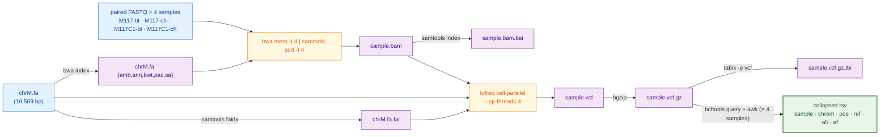

# Introduction

## Introduction

Frontier models from Anthropic, OpenAI, and Google write quality working code for data analysis tasks, but they cost cents to dollars per call, resulting in quickly ballooning bills. Asking Opus to write a hundred-line bash script every time a postdoc aligns a few FASTQ files spends the budget that should go to harder problems. We ask a simple question: can a frontier model write the recipe once, and a free, small open-weight model running on the lab's own hardware turn that recipe into a working script every time after?

Several groups have already asked what large language models (LLMs) can do for bioinformatics, but the questions they pose differ from ours. The earliest evaluations measured single-shot recall on genomics question-and-answer sets: GeneGPT [22] gave a closed model live access to NCBI web APIs and reported strong scores on the GeneTuring benchmark, and the 2025 GeneTuring re-run [23] put 1,600 questions to sixteen model configurations spanning closed frontiers (GPT-4o, Claude 3.5, Gemini) and small biomedical models (BioGPT, BioMedLM). A second strand swapped trivia for code on isolated puzzles. BioCoder [24] graded 2,269 short bioinformatics functions against unit tests and ran an open-versus-closed bake-off, but with code-completion models (InCoder, SantaCoder, StarCoder, CodeGen) that pre-date current open-weight chat models (publicly released model weights that anyone can download and run locally). BioLLMBench [25] scored GPT-4, Gemini and LLaMA on 24 tasks and found LLaMA often failed to emit runnable code, while an out-of-the-box study of 104 Rosalind problems [26] put GPT-3.5 ahead of GPT-4o and Llama-3-70B and compared all three to human solvers. More recent work moves from snippets to whole pipelines and to agentic systems (LLMs that plan, call tools, and revise their own output in a loop): BixBench [27] scores closed models on 50+ Dockerised computational-biology scenarios at roughly 17 % open-answer accuracy; BioMaster [28] wraps a Plan/Task/Debug/Check loop around retrieval-augmented generation (RAG, where the model is fed relevant documentation at query time) for RNA-seq, ChIP-seq, scRNA-seq and Hi-C; BioAgents [29] fine-tunes small open-weight models for local execution and claims expert-level performance on conceptual tasks; and two workflow-language studies generate Galaxy and Nextflow pipelines with closed models plus DeepSeek-V3 [30] or rerank Galaxy workflows with Mistral-7B against GPT-4o [31].

We differ from this body of work in four ways. First, every prior end-to-end evaluation either tests closed frontier models alone [22, 23, 27, 28, 30] or pits one or two older open-weight models against them [24, 25, 26, 31]; none place the current Anthropic, OpenAI, Google and Meta frontiers next to the open-weight models a lab can actually run today (Qwen3.6-27B, Llama 3.3 70B, Mistral, gpt-oss). Second, accuracy is almost always measured as a string match on a Q-and-A item or a unit test on an isolated function, not as whether a full pipeline runs to a VCF on real FASTQ input. Third, when open-weight models are tested at all, the hardware is left implicit; we report the same task on a Jetson AGX Orin, an RTX 5080 desktop, two Apple-silicon MacBooks and a 2× RTX A5000 workstation, so a reader can map model choice to the box on their bench. Fourth, no prior study separates the recipe (the natural-language plan a frontier model writes once) from the implementer (the local model that turns that recipe into bash on every run), which is the split that lets a lab pay for cloud inference once and then work offline. Together these gaps motivate the design of the present study.

To decide which open models to use we first need to survey the landscape of available models. For 2026 this landscape is summarized in Table 1 below. 

**Table 1.** Major open-weight model families as of May 2026.

| Lab | Family / latest | Sizes (total; active for MoE) | Architecture | Coder variant | Reasoning variant | License |
|---|---|---|---|---|---|---|
| Meta | Llama 4 [1] | Scout 109 B (17 B-A); Maverick 400 B (17 B-A); Behemoth ~2 T (unreleased) | Sparse MoE; multimodal | — | — | Llama 4 Community License (700 M-MAU cap; excludes EU users) |
| Alibaba | Qwen3.6 [2] | 0.6 B → 397 B (17 B-A); 27 B dense | Dense + MoE; thinking toggle | Qwen3-Coder-Next | Qwen3 thinking mode | Apache 2.0 |
| DeepSeek | DeepSeek-V4 [3] | V4-Flash 284 B (13 B-A); V4-Pro 1.6 T (49 B-A) | Sparse MoE | DeepSeek-Coder | V4-Pro Max mode | MIT |
| Mistral | Mistral Large 3, Mixtral, Codestral, Ministral [4] | 3 B → 675 B (41 B-A) | Granular MoE flagship; dense small | Codestral 25.08 | — | Apache 2.0 (Codestral non-production) |
| Google | Gemma 4 [5] | E2B, E4B, 26 B-MoE, 31 B-dense | Dense + MoE; multimodal | — | — | Apache 2.0 |
| IBM | Granite 4.1 / 4.0 [6] | 350 M, 1 B, 3 B, 8 B, 30 B; 4.0-H-Small 32 B (9 B-A) | Dense (4.1); hybrid Mamba-2 / MoE (4.0) | Granite-Code | — | Apache 2.0 |
| Allen AI | OLMo 3 [7] | 7 B, 32 B | Dense | — | OLMo 3-Think | Apache 2.0; **fully open** (weights + data + recipes) |
| Microsoft | Phi-4 [8] | mini 3.8 B, multimodal 5.6 B, 14 B | Dense; multimodal | — | Phi-4-reasoning 14 B | MIT |
| NVIDIA | Nemotron-3 *(new in late 2025)* [9] | Nano-Omni 30 B (3 B-A); Super 120 B (12 B-A) | Hybrid Mamba-Transformer MoE | — | built-in agentic stack | NVIDIA Open Model License; data + recipes |
| Cohere | Command A, Aya [10] | Aya 3.35 B → Command A 111 B | Dense | — | — | CC-BY-NC 4.0 — **research only** |

**Legend.**

- **Architecture.** Modern language models read input one piece at a time (each piece, called a *token*, is roughly a short word or word-fragment) and predict the next piece, by passing each token through a deep stack of trainable mathematical operations. Three architectural styles appear in the table:
    - *Dense.* Every internal weight is used on every token — the original transformer design and what most pre-2024 LLMs were. Simple to deploy, but compute per token scales with the model's full size.
    - *Sparse Mixture-of-Experts (MoE).* The model is split into many parallel "expert" sub-networks plus a small "router" that, for each token, picks one or two experts to handle it; the other experts stay idle. This lets the model be very large in *total* parameters (high stored capacity) while spending the per-token compute of a much smaller model. The cost is memory: every expert still has to be loaded, even the ones that won't fire on a given input. Every flagship released since late 2025 uses this design.
    - *Hybrid Mamba-Transformer.* A newer variant that replaces some standard layers with *state-space* (Mamba) layers. The practical consequence is that compute on a long input grows linearly with input length rather than quadratically — relevant now that flagships accept inputs of 500,000 to 1,000,000 tokens (a small book).
    - *Multimodal.* Accepts images, and sometimes audio, alongside text.
- **Parameters (B = billion, T = trillion).** Parameters are the trained numerical weights inside a model — loosely analogous to synapse strengths. More parameters mean more stored capacity but also more memory and more arithmetic per token. Two numbers matter:
    - *Total* parameters set disk and GPU-memory cost. A 70 B-parameter model occupies roughly 35–40 GB of memory at the standard 4-bit compression used for inference (a 16-bit "full precision" version would need ~140 GB).
    - *Active* parameters (notation `17 B-A` = 17 billion active per token) set the per-token compute cost. For dense models the two numbers are equal. For MoE models the active count is much smaller than the total because most experts don't fire on a given token. A 109 B (17 B-A) MoE runs about as fast per token as a 17 B dense model, but the machine still has to keep all 109 B parameters loaded.
- **Coder variant.** A general model further trained on a large corpus of source code (and tested on standard code-task benchmarks such as SWE-bench and HumanEval). Coder variants beat their general siblings on bash, Python, and refactor tasks but lose ground on chat, math, and translation.
- **Reasoning variant.** A model that, before answering, writes out a step-by-step reasoning trace ("chain of thought") that the user typically does not see; training rewards the model when its final answer is verifiably correct. Pioneered by DeepSeek-R1 (January 2025); every major lab has since copied the recipe. Reasoning variants score higher on math, code, and multi-step problems but take roughly 5×–50× longer per call (and cost 5×–50× more).

Table 1 has notable absences: Apple's 3-billion-parameter on-device model ships only inside iOS and macOS 26, and xAI has openly released only Grok-1 (March 2024) and Grok-2.5 (August 2025) — everything newer is closed. Every flagship since late 2025 is a sparse MoE, but dense persists below ~40 B because it is simpler to deploy, and Alibaba's April 2026 27 B dense Qwen3.6 beats their own 397 B MoE on coding benchmarks — training quality, not parameter count, now sets the ceiling.

Two practical filters narrow the choice for most labs. First, license: most weights now ship under Apache 2.0 or MIT (DeepSeek, Qwen, Gemma 4, Mistral Large 3, Granite, OLMo, Phi), but Meta's Llama 4 retains a custom Community License with a 700-million-monthly-active-user cap and an explicit exclusion of EU users, and Cohere's Command and Aya are research-and-non-commercial only. Anyone publishing a method built on a given model has to know which license applies. Second, hardware: the four size tiers in Table 1 map to four very different machines, from a \$400–\$600 consumer card for the smallest models to a multi-GPU server costing several hundred thousand dollars for the trillion-parameter tier (Table 2). Allen AI's OLMo and NVIDIA's Nemotron also release the training data and recipes, not just the weights — relevant when independent replication, not just inference, matters.

**Table 2.** GPU options and ballpark May 2026 US street prices for running each Table 1 model class locally at 4-bit compression. Where multiple cards are needed, the listed price is the per-card cost.

| Model class (Table 1 example) | GPU memory needed | GPU options (May 2026 USD) | Refs |
|---|---|---|---|
| **7–8 B dense** (Phi-4, Granite 8B, OLMo 3 7B) | ~5–6 GB | NVIDIA RTX 5060 Ti 16 GB (~\$560); RTX 4060 Ti 16 GB (~\$430); RTX 5070 12 GB (~\$635); Apple M4 Mac mini 16 GB unified (~\$600) | [11, 16] |
| **27–32 B dense** (Qwen3.6-27B, Gemma 4 31B, OLMo 3 32B) | ~17–22 GB | NVIDIA RTX 5090 32 GB (~\$2,900–\$3,500, street price 50–75 % over \$1,999 MSRP); RTX 4090 24 GB (~\$1,500–\$2,200, EOL Oct 2024); RTX A5000 24 GB (~\$700–\$1,400 used); Apple Mac Studio M3 Ultra 96 GB unified (~\$4,000) | [11, 12, 16] |
| **100–400 B MoE** (Llama 4 Scout 109B, Maverick 400B) | ~55–250 GB | NVIDIA RTX Pro 6000 Blackwell 96 GB (~\$8,500); 2× RTX 5090 (~\$6,000–\$7,000 total); RTX 6000 Ada 48 GB (~\$6,800); H100 80 GB (~\$25K–\$33K); AMD Instinct MI300X 192 GB (~\$15K–\$20K, OEM-only); Apple Mac Studio M3 Ultra 256 GB unified (~\$9,500) | [11, 12, 13, 14, 16] |
| **Trillion-parameter MoE** (DeepSeek-V4-Pro 1.6T) | ~700+ GB | NVIDIA H200 141 GB (~\$31K–\$40K each); B200 192 GB (~\$35K–\$55K each); 8-GPU DGX H200 server (~\$350K–\$500K); GB200 NVL72 rack (~\$3M+); cloud rental on B200 ~\$2.25–\$16/GPU-hour | [13, 15] |

May 2026 prices are dominated by an ongoing HBM/GDDR7 shortage; consumer NVIDIA 50-series cards and high-RAM Apple Mac Studio configurations sit 30–75 % above launch MSRP. AMD MI300X and the newer MI325X are sold almost exclusively through OEM channels — public per-card numbers reflect bulk pricing or cloud rental rates [13]. The used market is liquid for retired flagships (RTX 4090, RTX A5000) and is often the cheapest path into the 27–32 B tier [11].

Given this (rapidly evolving) landscape we decided to do the following experiment: take a common sequencing data processing workflow and ask open models running on hardware accessible to an average research lab to design and execute the analysis. In doing so we experimented with a range of possibilities ranging from allowing open models to figure out everything by themselves to guiding them using a very detailed plan produced by commercial frontier models. We further complicated these tasks by simulating a variety of errors that may occur during workflow execution.

## Materials and Methods

### Hardware

We selected five different computers listed in Table 3. It is a combination ranging from an old workstation saved from university salvage and a desktop with a gaming GPU to the latest MacBooks and a purpose-built inexpensive NVIDIA device---NVIDIA Jetson AGX Orin. The Orin is a "RaspberryPi"-like offering from NVIDIA that costs under $2,000 and has a very small footprint making it an idea lab-ready tiny but powerful workstation.

**Table 3.** Test machines used in this study.

| Computer | Manufacturer | Year released | RAM | OS | GPU |
|---|---|---|---|---|---|
| NVIDIA Jetson AGX Orin Developer Kit | NVIDIA | 2022 | 64 GB LPDDR5 (unified with GPU) | Ubuntu 22.04 LTS (NVIDIA JetPack 6) | Integrated Ampere, 2,048 CUDA cores + 64 Tensor cores |
| RTX 5080 desktop | Dell | 2025 (GPU) | 64 GB DDR5 (system) | Linux (Ubuntu) | NVIDIA RTX 5080, 10,752 CUDA cores, 16 GB GDDR7 |
| MacBook Air M4 (24 GB) | Apple | 2025 | 24 GB LPDDR5X (unified with GPU) | macOS 26 | Apple M4 integrated GPU, 10 cores |
| MacBook Pro M4 Pro (48 GB) | Apple | 2024 | 48 GB LPDDR5X (unified with GPU) | macOS Sequoia 15.6 | Apple M4 Pro integrated GPU, 16 to 20 cores |
| 2× NVIDIA RTX A5000 desktop | Dell | 2021 (GPUs) | 128 GB DDR4 (system) | Linux (Ubuntu 25.10) | 2× NVIDIA RTX A5000, 8,192 CUDA cores each, 24 GB GDDR6 each (48 GB total) |

System RAM listed for the two Linux desktops reflects the build configuration; for inference workloads the relevant memory is the GPU VRAM (last column). For the Jetson and the MacBook, RAM is unified between CPU and GPU and the model can use up to roughly the listed RAM minus the operating-system reservation.

### Data

We selected a small dataset [17] derived from our previous work on the analysis of mutational patterns in human mitochondria [18]. It contains four paired-end Illumina samples derived from blood and cheek tissues of a mother–child pair. It contains two fixed changes and a low-frequency variant in the child's cheek sample — a heteroplasmy example.

### Workflow

We developed a simplified version of a haploid variant-calling workflow (original: [19]) that omits pre-processing steps before variant calling and the variant-annotation phase [20, 21]. The structure of the workflow is shown in Fig. 1 below.

**Figure 1.** Data flow of the simplified mtDNA variant-calling workflow used in this study. Per-sample steps (alignment through tabix) run independently for each of the four samples; the only inter-sample dependency is the final `bcftools query + awk` fan-in that builds `collapsed.tsv`.



### Plans

We wanted to ask free models to perform variant calling using these data in several ways: with no plan, and guided by several plans of increasing granularity. The plans are briefly described in Table 4 below and listed in their full form in the Supplement section.

**Table 4.** Plan variants used in this study. Plans of increasing granularity, plus two "no-plan" controls. File sizes are bytes; full text for each plan file is in the Supplement.

| Plan | File | Size | Short summary | Hypothesis tested |
|---|---|---:|---|---|
| **Track B** | *(no plan)* | 0 | Problem statement + tool inventory only; no implementation hints | How much can a model do from scratch? |
| **v0.5** | `prompts/track_b_with_order_user.tmpl` | 1.4 KB | Track B + one line giving the tool order: `bwa → samtools → lofreq → bcftools → awk` | Does sequencing alone help local models? |
| **v1 (lean)** | `plan/PLAN_v1.md` | 3.1 KB | Numbered bullets naming tools and key flags; no exact command lines | Reference lean plan |
| **v1.25** | `plan/PLAN_v1p25.md` | 3.1 KB | v1 + the exact `lofreq call-parallel` command line | Does one full command bridge the v1 → v2 gap? |
| **v1.5** | `plan/PLAN_v1p5.md` | 1.3 KB | v2 with every prose paragraph and Gotchas block stripped — code fences only | Are the prose explanations load-bearing or decorative? |
| **v1g** | `plan/PLAN_v1g.md` | 4.2 KB | v1 + a Galaxy-IUC-mechanical `lofreq` snippet (extracted from `tools-iuc@39e7456`) | Can a tool registry replace a human plan author? |
| **v2 (detailed)** | `plan/PLAN.md` | 4.6 KB | Every step gives the exact command line plus Gotchas block | Reference detailed plan |
| **v2_defensive** | `plan/PLAN_v2_defensive.md` | 6.5 KB | v2 + `try()` helper, output validation after every step, retry-once, per-sample isolation, structured failure log | Does explicit error-handling prose make implementer scripts defensive against runtime tool failures? |


### Error simulation

To test how each model handles tool failures, we wrapped `bwa` and `lofreq` in short shell scripts ("shims") that imitate the real binaries on disk. Before each run, the harness writes the two shims into a per-run directory and adds that directory to the front of `PATH` — the colon-separated list of directories the shell consults when it needs to find an executable. When the script types `bwa mem`, the shell finds the shim first and runs it instead of the real `bwa`. Each shim reads two environment variables: `EVAL_INJECT_PATTERN` names the failure type and `EVAL_INJECT_TARGET` names which of `bwa` or `lofreq` the failure applies to. For every untargeted invocation the shim passes the call straight through to the real binary; for the targeted invocation it injects the failure and then either passes through or stops. The model's `run.sh` does not know it is being intercepted.

Seven failure patterns cover the kinds of breakage a real lab pipeline encounters (Table 5). Each pattern is paired with one tool (or both), so a full error-matrix cell is one (model × plan × pattern × target tool × seed) combination. We use seeds 42, 43 and 44, and run every cell on both the `v2` and the `v2_defensive` plan to measure how the defensive prose changes outcomes.

**Table 5.** Failure patterns injected by the PATH shims into `bwa` and / or `lofreq`.

| Pattern | Affected tool | What the shim does |
|---|---|---|
| `flake_first_call` | both | First call exits 1; later calls pass through. |
| `one_sample_fails` | both | Shim exits 1 only when `M117C1-ch` appears in the command line; the other three samples run clean. |
| `slow_tool` | both | Sleep 30 s, then run the real tool — output identical, just delayed. |
| `stderr_warning_storm` | both | Dump 200 lines of `WARNING:` text to stderr, then run the real tool — output is correct but the stderr looks alarming. |
| `missing_lib_error` | both | Exit 127 without invoking the real tool, mimicking a missing shared library (`error while loading shared libraries: libhts.so.3: cannot open shared object file`). |
| `silent_truncation` | lofreq only | Run the real `lofreq`, then truncate the `-o` output file to zero bytes — `lofreq` returns 0 but the VCF is empty. |
| `wrong_format_output` | lofreq only | Run the real `lofreq`, then strip every variant line from the VCF; only the header survives — the file still parses, but contains no calls. |

Beyond the variant-overlap score `M3`, we score each cell on three error-handling metrics. `m_handle` classifies the script's overall response as `crash` (exited non-zero with no failure log), `propagate` (the failure passed through to a downstream step), `partial` (the script aborted but recorded the failure structurally), or `recover` (the script completed successfully despite the injection). `m_recover` is binary: did the script produce the count of valid VCFs that the failure pattern allows? For `one_sample_fails` the best achievable is 3 (the bad sample's VCF is correctly absent); for `silent_truncation`, `wrong_format_output` and `missing_lib_error` the best is 0 (the script should detect the broken or missing output and skip it); for the remaining three patterns the best is 4. `m_diagnose` is binary: did the script announce the failure — through a populated `failures.log`, a summary line on stderr, or a sample-name-and-failure-word pair in its output — or did it stay silent? All three metrics are defined in `score/score_run.py:error_handling`.

## References

[1] Meta. Llama 4: a new crop of flagship AI models. *TechCrunch*, April 5, 2025. https://techcrunch.com/2025/04/05/meta-releases-llama-4-a-new-crop-of-flagship-ai-models/

[2] Alibaba (Qwen team). Qwen3.6 family. GitHub. https://github.com/QwenLM/Qwen3.6

[3] DeepSeek-AI. DeepSeek-V4 preview release notes. DeepSeek API documentation, April 24, 2026. https://api-docs.deepseek.com/news/news260424

[4] Mistral AI. Introducing Mistral 3. Mistral AI news, December 2, 2025. https://mistral.ai/news/mistral-3

[5] Google. Introducing Gemma 4. Google blog, April 2, 2026. https://blog.google/innovation-and-ai/technology/developers-tools/gemma-4/

[6] IBM Research. Granite 4.1 AI foundation models. April 30, 2026. https://research.ibm.com/blog/granite-4-1-ai-foundation-models

[7] Allen Institute for AI (Ai2). OLMo 3. November 20, 2025. https://allenai.org/blog/olmo3

[8] Microsoft. Welcome to the new Phi-4 models — Phi-4-mini and Phi-4-multimodal. Microsoft TechCommunity, Educator Developer Blog. https://techcommunity.microsoft.com/blog/educatordeveloperblog/welcome-to-the-new-phi-4-models---microsoft-phi-4-mini--phi-4-multimodal/4386037

[9] NVIDIA. NVIDIA debuts Nemotron 3 family of open models. NVIDIA Newsroom. https://nvidianews.nvidia.com/news/nvidia-debuts-nemotron-3-family-of-open-models

[10] Cohere. Models — Command A, Aya. Cohere docs. https://docs.cohere.com/docs/models

[11] BestValueGPU. Consumer NVIDIA RTX GPU price history and specifications (RTX 4060 Ti, 4090, 5060 Ti, 5070, 5090). https://bestvaluegpu.com/

[12] Thunder Compute. NVIDIA RTX Pro 6000 Blackwell pricing analysis. https://www.thundercompute.com/blog/nvidia-rtx-pro-6000-pricing

[13] Thunder Compute. AMD Instinct MI300X pricing. https://www.thundercompute.com/blog/amd-mi300x-pricing

[14] Jarvis Labs. NVIDIA H100 80 GB pricing guide. https://jarvislabs.ai/blog/h100-price

[15] Northflank. NVIDIA B200 cost analysis and cloud rental rates. https://northflank.com/blog/how-much-does-an-nvidia-b200-gpu-cost

[16] Apple. Mac Studio configurations and pricing. https://www.apple.com/mac-studio/specs/

[17] Nekrutenko A. Datasets for Galaxy Collection Operations Tutorial. *Zenodo* dataset, 2021. doi:10.5281/zenodo.5119008. https://zenodo.org/records/5119008

[18] Rebolledo-Jaramillo B, Su MS, Stoler N, McElhoe JA, Dickins B, Blankenberg D, Korneliussen TS, Chiaramonte F, Nielsen R, Holland MM, Paul IM, Nekrutenko A, Makova KD. Maternal age effect and severe germ-line bottleneck in the inheritance of human mitochondrial DNA. *Proc Natl Acad Sci U S A.* 2014;111(43):15474–15479. https://pubmed.ncbi.nlm.nih.gov/25313049/

[19] Nekrutenko A. iwc-workflows/haploid-variant-calling-wgs-pe (v0.1). *Zenodo*, March 24, 2025. doi:10.5281/zenodo.15078463. https://zenodo.org/records/15078463

[20] Maier W, Bray S, van den Beek M, Bouvier D, Coraor N, Miladi M, Singh B, De Argila JR, Baker D, Roach N, Gladman S, Coppens F, Martin DP, Lonie A, Grüning B, Kosakovsky Pond SL, Nekrutenko A. Ready-to-use public infrastructure for global SARS-CoV-2 monitoring. *Nat Biotechnol.* 2021;39(10):1178–1179. https://pubmed.ncbi.nlm.nih.gov/34588690/

[21] Mei H, Arbeithuber B, Cremona MA, DeGiorgio M, Nekrutenko A. A high-resolution view of adaptive event dynamics in a plasmid. *Genome Biol Evol.* 2019;11(10):3022–3034. https://pubmed.ncbi.nlm.nih.gov/31539047/

[22] Jin Q, Yang Y, Chen Q, Lu Z. GeneGPT: augmenting large language models with domain tools for improved access to biomedical information. *Bioinformatics.* 2024;40(2):btae075. doi:10.1093/bioinformatics/btae075. PMID:38341654.

[23] Shang X, Liao X, Ji Z, Hou W. Benchmarking large language models for genomic knowledge with GeneTuring. *Brief Bioinform.* 2025;26(5):bbaf492. doi:10.1093/bib/bbaf492.

[24] Tang X, Qian B, Gao R, Chen J, Chen X, Gerstein MB. BioCoder: a benchmark for bioinformatics code generation with large language models. *Bioinformatics.* 2024;40(Suppl_1):i266–i276. doi:10.1093/bioinformatics/btae230. PMID:38940140.

[25] Sarwal V, Andreoletti G, Munteanu V, Suhodolschi A, Ciorba D, Bostan V, Dimian M, Eskin E, Wang W, Mangul S. BioLLMBench: a benchmark for large language models in bioinformatics. *bioRxiv*; 2023. doi:10.1101/2023.12.19.572483.

[26] Rajesh V, Siwo GH. Out-of-the-box bioinformatics capabilities of large language models (LLMs). *bioRxiv*; 2025. doi:10.1101/2025.08.22.671610. PMID:40909484.

[27] Mitchener L, Laurent JM, Andonian A, Tenmann B, Narayanan S, Wellawatte GP, White A, Sani L, Rodriques SG. BixBench: a comprehensive benchmark for LLM-based agents in computational biology. *arXiv*:2503.00096; 2025. https://arxiv.org/abs/2503.00096

[28] Su H, Long W, Zhang Y. BioMaster: multi-agent system for automated bioinformatics analysis workflow. *bioRxiv*; 2025. doi:10.1101/2025.01.23.634608.

[29] Mehandru N, Hall AK, Melnichenko O, Dubinina Y, Tsirulnikov D, Bamman D, Alaa A, Saponas S, Malladi VS. BioAgents: bridging the gap in bioinformatics analysis with multi-agent systems. *Sci Rep.* 2025;15:39036. doi:10.1038/s41598-025-25919-z.

[30] Alam K, Roy B. From Prompt to Pipeline: large language models for scientific workflow development in bioinformatics. *arXiv*:2507.20122; 2025. https://arxiv.org/abs/2507.20122

[31] Cynthia ST, Roy B. Towards LLM-powered task-aware retrieval of scientific workflows for Galaxy. *arXiv*:2511.01757; 2025. https://arxiv.org/abs/2511.01757


---

## Supplement

The full text of each plan file referenced in Table 4. Each plan is reproduced verbatim from `plan/` in the repository and shown inside a fenced Markdown block to preserve its original heading hierarchy and code formatting.

### Plan v1 (lean) — `plan/PLAN_v1.md`

````markdown
# Per-sample mtDNA amplicon variant-calling plan

1. **Set globals and prepare results directory**
   - Define `THREADS=4` and the sample list: `M117-bl M117-ch M117C1-bl M117C1-ch`.
   - Create `results/` if missing. Use `set -euo pipefail`.
   - Treat every output step as idempotent: guard each artifact with an existence check (e.g. skip if `results/{sample}.vcf.gz.tbi` already exists and is newer than its inputs). Re-runs on a fully populated `results/` must exit 0 without re-doing work.

2. **Reference indexing (once, in `data/ref/`)**
   - `samtools faidx data/ref/chrM.fa` → produces `chrM.fa.fai`.
   - `bwa index data/ref/chrM.fa` → produces the `.amb .ann .bwt .pac .sa` set.
   - Skip both if the index files already exist.

3. **Per-sample alignment with `bwa mem`**
   - Use `bwa mem -t 4` with the paired FASTQs `data/raw/{sample}_1.fq.gz` and `data/raw/{sample}_2.fq.gz`.
   - Pass the read group via `-R` as a single double-quoted argument containing literal backslash-t between fields and colons between key and value:
     - exact form: `-R "@RG\tID:{sample}\tSM:{sample}\tLB:{sample}\tPL:ILLUMINA"`
     - The `\t` must remain the two characters backslash and `t` — bwa parses them itself. Do NOT use `printf`, `echo -e`, `$'\t'`, or any mechanism that turns them into real tabs; bwa rejects real tabs with “the read group line contained literal <tab> characters”.
     - Separators between key and value are colons `:`, not `=`.

4. **SAM → sorted BAM**
   - Pipe `bwa mem` stdout into `samtools sort -@ 4 -o results/{sample}.bam`.
   - Do NOT run `markdup` or `rmdup`: this is amplicon data where PCR duplicates are expected and biologically meaningful.

5. **BAM indexing**
   - `samtools index -@ 4 results/{sample}.bam` → `results/{sample}.bam.bai`.

6. **Variant calling with `lofreq call-parallel`**
   - Use the `call-parallel` subcommand (not plain `lofreq call`) with `--pp-threads 4`.
   - Reference: `data/ref/chrM.fa`. Input: `results/{sample}.bam`.
   - Write uncompressed VCF to a temporary path (e.g. `results/{sample}.vcf`); lofreq emits plain VCF.

7. **VCF compression and indexing**
   - Compress with `bgzip` (not `bcftools view -O z`) producing `results/{sample}.vcf.gz`.
   - Index with `tabix -p vcf results/{sample}.vcf.gz` → `results/{sample}.vcf.gz.tbi`.
   - Remove the intermediate uncompressed `.vcf`.

8. **Collapse step → `results/collapsed.tsv`**
   - For each sample, run `bcftools query -f '{sample}\t%CHROM\t%POS\t%REF\t%ALT\t%INFO/AF\n' results/{sample}.vcf.gz` (the `{sample}` literal is prepended via the format string so the sample name is attached per row).
   - Concatenate all four samples’ output.
   - Prepend a single header line `sample\tchrom\tpos\tref\talt\taf` (tab-separated).
   - Output is tab-separated, one variant per line, header on, written to `results/collapsed.tsv`. Rebuild only if any input VCF is newer than the TSV.

9. **Idempotency check**
   - Final pass: re-running the script on a fully populated `results/` exits 0, performs no work, and leaves all eight per-sample artifacts plus `collapsed.tsv` intact.
````

### Plan v1.25 — `plan/PLAN_v1p25.md`

````markdown
# Per-sample mtDNA amplicon variant-calling plan

1. **Set globals and prepare results directory**
   - Define `THREADS=4` and the sample list: `M117-bl M117-ch M117C1-bl M117C1-ch`.
   - Create `results/` if missing. Use `set -euo pipefail`.
   - Treat every output step as idempotent: guard each artifact with an existence check (e.g. skip if `results/{sample}.vcf.gz.tbi` already exists and is newer than its inputs). Re-runs on a fully populated `results/` must exit 0 without re-doing work.

2. **Reference indexing (once, in `data/ref/`)**
   - `samtools faidx data/ref/chrM.fa` → produces `chrM.fa.fai`.
   - `bwa index data/ref/chrM.fa` → produces the `.amb .ann .bwt .pac .sa` set.
   - Skip both if the index files already exist.

3. **Per-sample alignment with `bwa mem`**
   - Use `bwa mem -t 4` with the paired FASTQs `data/raw/{sample}_1.fq.gz` and `data/raw/{sample}_2.fq.gz`.
   - Pass the read group via `-R` as a single double-quoted argument containing literal backslash-t between fields and colons between key and value:
     - exact form: `-R "@RG\tID:{sample}\tSM:{sample}\tLB:{sample}\tPL:ILLUMINA"`
     - The `\t` must remain the two characters backslash and `t` — bwa parses them itself. Do NOT use `printf`, `echo -e`, `$'\t'`, or any mechanism that turns them into real tabs; bwa rejects real tabs with “the read group line contained literal <tab> characters”.
     - Separators between key and value are colons `:`, not `=`.

4. **SAM → sorted BAM**
   - Pipe `bwa mem` stdout into `samtools sort -@ 4 -o results/{sample}.bam`.
   - Do NOT run `markdup` or `rmdup`: this is amplicon data where PCR duplicates are expected and biologically meaningful.

5. **BAM indexing**
   - `samtools index -@ 4 results/{sample}.bam` → `results/{sample}.bam.bai`.

6. **Variant calling with `lofreq call-parallel`**
   - Exact command:
     ```
     lofreq call-parallel --pp-threads 4 -f data/ref/chrM.fa -o results/{sample}.vcf results/{sample}.bam
     ```
   - Output: `results/{sample}.vcf` (uncompressed). lofreq emits plain VCF.

7. **VCF compression and indexing**
   - Compress with `bgzip` (not `bcftools view -O z`) producing `results/{sample}.vcf.gz`.
   - Index with `tabix -p vcf results/{sample}.vcf.gz` → `results/{sample}.vcf.gz.tbi`.
   - Remove the intermediate uncompressed `.vcf`.

8. **Collapse step → `results/collapsed.tsv`**
   - For each sample, run `bcftools query -f '{sample}\t%CHROM\t%POS\t%REF\t%ALT\t%INFO/AF\n' results/{sample}.vcf.gz` (the `{sample}` literal is prepended via the format string so the sample name is attached per row).
   - Concatenate all four samples’ output.
   - Prepend a single header line `sample\tchrom\tpos\tref\talt\taf` (tab-separated).
   - Output is tab-separated, one variant per line, header on, written to `results/collapsed.tsv`. Rebuild only if any input VCF is newer than the TSV.

9. **Idempotency check**
   - Final pass: re-running the script on a fully populated `results/` exits 0, performs no work, and leaves all eight per-sample artifacts plus `collapsed.tsv` intact.
````

### Plan v1.5 — `plan/PLAN_v1p5.md`

````markdown
# Implementation Plan: Per-sample mtDNA Variant Calling

## Boilerplate (top of `run.sh`)

```
set -euo pipefail
THREADS=4
SAMPLES=("M117-bl" "M117-ch" "M117C1-bl" "M117C1-ch")
mkdir -p results
```

All per-sample steps run in `for sample in "${SAMPLES[@]}"; do ... done`.

---

## 1. Reference indexing — BWA

```
bwa index data/ref/chrM.fa
```

## 2. Reference indexing — samtools faidx

```
samtools faidx data/ref/chrM.fa
```

## 3. Per-sample alignment + sort (one pipeline)

```
bwa mem -t 4 -R "@RG\tID:{sample}\tSM:{sample}\tLB:{sample}\tPL:ILLUMINA" data/ref/chrM.fa data/raw/{sample}_1.fq.gz data/raw/{sample}_2.fq.gz | samtools sort -@ 4 -o results/{sample}.bam -
```

## 4. BAM index

```
samtools index -@ 4 results/{sample}.bam
```

## 5. Variant calling — LoFreq

```
lofreq call-parallel --pp-threads 4 -f data/ref/chrM.fa -o results/{sample}.vcf results/{sample}.bam
```

## 6. VCF compression + tabix index

```
bgzip -f results/{sample}.vcf
```
```
tabix -p vcf results/{sample}.vcf.gz
```

## 7. Collapsed TSV

```
printf 'sample\tchrom\tpos\tref\talt\taf\n' > results/collapsed.tsv
```
```
bcftools query -f '%CHROM\t%POS\t%REF\t%ALT\t%INFO/AF\n' results/{sample}.vcf.gz | awk -v s={sample} 'BEGIN{OFS="\t"}{print s,$0}' >> results/collapsed.tsv
```
````

### Plan v1g — `plan/PLAN_v1g.md`

````markdown
# Per-sample mtDNA amplicon variant-calling plan
<!--
v1g = v1 with Galaxy-IUC-derived CLI snippets injected per step where IUC has
clean coverage. Extracted mechanically by scripts/galaxy_to_snippet.py from
tools-iuc commit 39e745658a6ff7f013788871916574117a0f47f1 (2026-04-27).

IUC coverage map:
  bwa, bwa-mem        : extraction yields mostly noise (heavy macro use) — fallback to v1 prose
  samtools_faidx       : all-conditional command block — fallback to v1 prose
  samtools_sort        : partial extraction with placeholders — fallback to v1 prose
  samtools_index       : not in IUC — fallback to v1 prose
  lofreq_call_parallel : clean extraction — INJECTED (step 6)
  bgzip / tabix        : not in IUC — fallback to v1 prose
  bcftools_query       : format string in stripped Cheetah var — fallback to v1 prose
-->

1. **Set globals and prepare results directory**
   - Define `THREADS=4` and the sample list: `M117-bl M117-ch M117C1-bl M117C1-ch`.
   - Create `results/` if missing. Use `set -euo pipefail`.
   - Treat every output step as idempotent: guard each artifact with an existence check (e.g. skip if `results/{sample}.vcf.gz.tbi` already exists and is newer than its inputs). Re-runs on a fully populated `results/` must exit 0 without re-doing work.

2. **Reference indexing (once, in `data/ref/`)**
   - `samtools faidx data/ref/chrM.fa` → produces `chrM.fa.fai`.
   - `bwa index data/ref/chrM.fa` → produces the `.amb .ann .bwt .pac .sa` set.
   - Skip both if the index files already exist.

3. **Per-sample alignment with `bwa mem`**
   - Use `bwa mem -t 4` with the paired FASTQs `data/raw/{sample}_1.fq.gz` and `data/raw/{sample}_2.fq.gz`.
   - Pass the read group via `-R` as a single double-quoted argument containing literal backslash-t between fields and colons between key and value:
     - exact form: `-R "@RG\tID:{sample}\tSM:{sample}\tLB:{sample}\tPL:ILLUMINA"`
     - The `\t` must remain the two characters backslash and `t` — bwa parses them itself. Do NOT use `printf`, `echo -e`, `$'\t'`, or any mechanism that turns them into real tabs; bwa rejects real tabs with “the read group line contained literal <tab> characters”.
     - Separators between key and value are colons `:`, not `=`.

4. **SAM → sorted BAM**
   - Pipe `bwa mem` stdout into `samtools sort -@ 4 -o results/{sample}.bam`.
   - Do NOT run `markdup` or `rmdup`: this is amplicon data where PCR duplicates are expected and biologically meaningful.

5. **BAM indexing**
   - `samtools index -@ 4 results/{sample}.bam` → `results/{sample}.bam.bai`.

6. **Variant calling with `lofreq call-parallel`**
   - Galaxy IUC canonical invocation (extracted from `tools/lofreq/lofreq_call.xml` @ tools-iuc 39e7456):
     ```
     lofreq call-parallel --pp-threads 4 --verbose
     --ref data/ref/chrM.fa --out results/{sample}.vcf
     --sig
     --bonf
     results/{sample}.bam
     ```
     (The bare `--sig` and `--bonf` lines come from Galaxy-runtime-supplied values; you can omit them and use lofreq's defaults. The load-bearing detail is that `results/{sample}.bam` is a **positional argument at the end**, not behind `-i`/`-b`/`-bam`.)

7. **VCF compression and indexing**
   - Compress with `bgzip` (not `bcftools view -O z`) producing `results/{sample}.vcf.gz`.
   - Index with `tabix -p vcf results/{sample}.vcf.gz` → `results/{sample}.vcf.gz.tbi`.
   - Remove the intermediate uncompressed `.vcf`.

8. **Collapse step → `results/collapsed.tsv`**
   - For each sample, run `bcftools query -f '{sample}\t%CHROM\t%POS\t%REF\t%ALT\t%INFO/AF\n' results/{sample}.vcf.gz` (the `{sample}` literal is prepended via the format string so the sample name is attached per row).
   - Concatenate all four samples’ output.
   - Prepend a single header line `sample\tchrom\tpos\tref\talt\taf` (tab-separated).
   - Output is tab-separated, one variant per line, header on, written to `results/collapsed.tsv`. Rebuild only if any input VCF is newer than the TSV.

9. **Idempotency check**
   - Final pass: re-running the script on a fully populated `results/` exits 0, performs no work, and leaves all eight per-sample artifacts plus `collapsed.tsv` intact.
````

### Plan v2 (detailed) — `plan/PLAN.md`

````markdown
# Implementation Plan: Per-sample mtDNA Variant Calling

## Boilerplate (top of `run.sh`)
- First line after shebang: `set -euo pipefail`.
- Constants: `THREADS=4` and `SAMPLES=("M117-bl" "M117-ch" "M117C1-bl" "M117C1-ch")`.
- Create output dir: `mkdir -p results`.
- All per-sample steps must be wrapped in `for sample in "${SAMPLES[@]}"; do ... done`.

---

## 1. Reference indexing — BWA

```
bwa index data/ref/chrM.fa
```

- Outputs (5 sibling files): `data/ref/chrM.fa.amb`, `.ann`, `.bwt`, `.pac`, `.sa`.
- Idempotency guard: `[[ -f data/ref/chrM.fa.bwt ]] || bwa index data/ref/chrM.fa`
- Gotcha: `bwa index` writes outputs next to the input; the dir must be writable. No flags needed for a 16 kb reference (default algorithm is fine).

## 2. Reference indexing — samtools faidx

```
samtools faidx data/ref/chrM.fa
```

- Output: `data/ref/chrM.fa.fai`.
- Guard: `[[ -f data/ref/chrM.fa.fai ]] || samtools faidx data/ref/chrM.fa`

## 3. Per-sample alignment + sort (one pipeline)

```
bwa mem -t 4 -R "@RG\tID:{sample}\tSM:{sample}\tLB:{sample}\tPL:ILLUMINA" data/ref/chrM.fa data/raw/{sample}_1.fq.gz data/raw/{sample}_2.fq.gz | samtools sort -@ 4 -o results/{sample}.bam -
```

- Output: `results/{sample}.bam`.
- Guard: `[[ -f results/{sample}.bam ]] || { bwa mem ... | samtools sort ... ; }` — wrap the whole pipeline in braces so the guard covers both stages.
- RG string gotchas (CRITICAL):
  - Use colons (`ID:`, `SM:`, `LB:`, `PL:`) — never `=`.
  - Use the **literal two characters** `\t` (backslash + t) inside the double-quoted string. Do NOT use `printf`, `echo -e`, `$'\t'`, or a real tab. `bwa` expands `\t` itself; a real tab corrupts the SAM header.
  - The whole `-R` value must be a single double-quoted argument.
- `samtools sort` trailing `-` reads from stdin.

## 4. BAM index

```
samtools index -@ 4 results/{sample}.bam
```

- Output: `results/{sample}.bam.bai`.
- Guard: `[[ -f results/{sample}.bam.bai ]] || samtools index -@ 4 results/{sample}.bam`
- Do NOT run `markdup` — this is amplicon data; PCR duplicates are expected and informative.

## 5. Variant calling — LoFreq

```
lofreq call-parallel --pp-threads 4 -f data/ref/chrM.fa -o results/{sample}.vcf results/{sample}.bam
```

- Output: `results/{sample}.vcf` (uncompressed).
- Guard: `[[ -f results/{sample}.vcf || -f results/{sample}.vcf.gz ]] || lofreq call-parallel --pp-threads 4 -f data/ref/chrM.fa -o results/{sample}.vcf results/{sample}.bam`
  (Check both because step 6 will delete the `.vcf` and leave `.vcf.gz`.)
- Gotchas: BAM is positional, NOT behind `-b`/`-i`. The flag is `--pp-threads`, not `-t` or `--threads`. Reference (`-f`) requires the `.fai` from step 2 to already exist.

## 6. VCF compression + tabix index

```
bgzip -f results/{sample}.vcf
```
```
tabix -p vcf results/{sample}.vcf.gz
```

- Outputs: `results/{sample}.vcf.gz` and `results/{sample}.vcf.gz.tbi`.
- Combined guard: `[[ -f results/{sample}.vcf.gz.tbi ]] || { bgzip -f results/{sample}.vcf && tabix -p vcf results/{sample}.vcf.gz ; }`
- Gotchas: `bgzip` operates **in place** — it deletes `results/{sample}.vcf` after writing `.vcf.gz`. `-f` overwrites any stale `.vcf.gz`. `tabix -p vcf` sets the preset for VCF coordinates.

## 7. Collapsed TSV (rebuild every run)

Do NOT guard this step — always overwrite, since per-sample VCFs may have changed.

Header (overwrite):

```
printf 'sample\tchrom\tpos\tref\talt\taf\n' > results/collapsed.tsv
```

Per sample, append:

```
bcftools query -f '%CHROM\t%POS\t%REF\t%ALT\t%INFO/AF\n' results/{sample}.vcf.gz | awk -v s={sample} 'BEGIN{OFS="\t"}{print s,$0}' >> results/collapsed.tsv
```

- Gotchas:
  - The format string uses `%INFO/AF`, not `%AF` — bcftools requires the `INFO/` prefix for INFO fields.
  - The `\t` and `\n` inside `-f '...'` are **bcftools format codes**, parsed by bcftools itself; keep them inside single quotes so the shell doesn't touch them.
  - awk's `OFS="\t"` is required so `print s,$0` joins with a tab (`$0` already contains the tabbed bcftools row, so the result is `sample<TAB>chrom<TAB>pos<TAB>ref<TAB>alt<TAB>af`).
  - Use `>` for the header line, `>>` for every per-sample append.

---

## Idempotency summary
- Steps 1–6 each have a `[[ -f <sentinel> ]] ||` guard on their final output. A second invocation on a populated `results/` performs no alignment, calling, compression, or indexing work.
- Step 7 is intentionally rebuilt from scratch on every run (header `>`, then append per sample). This is cheap (one `bcftools query` per sample) and prevents stale rows if any VCF changed. Exit status of a fully-cached run is `0`.
````

### Plan v2_defensive — `plan/PLAN_v2_defensive.md`

````markdown
# `run.sh` Implementation Plan — chrM amplicon variant calling

## 0. Script preamble (top of file)

1. First line after shebang: `set -euo pipefail`.
2. Constants: `THREADS=4` and `SAMPLES=("M117-bl" "M117-ch" "M117C1-bl" "M117C1-ch")`.
3. Paths: `REF=data/ref/chrM.fa`, `OUT=results`.
4. `mkdir -p "$OUT"`.
5. Initialize the failure log every run (truncate, no header — pure TSV body): `: > "$OUT/failures.log"`.
6. Track survivors with an array: `SURVIVORS=()` and a counter `OK=0`.

## 0a. Defensive helper `try`

Define this function exactly:

```
try() {  # try <sample> <step_label> <validation_cmd_string> -- <cmd...>
  local sample="$1" step="$2" validate="$3"; shift 3
  [[ "$1" == "--" ]] && shift
  if "$@" && eval "$validate"; then return 0; fi
  "$@" && eval "$validate" && return 0
  printf '%s\t%s\t%s\n' "$sample" "$step" "command_or_validation_failed" >> "$OUT/failures.log"
  return 1
}
```

Behavior: runs `cmd`, then evaluates the validation string; on any failure retries the **same cmd + same validation** exactly once; on second failure appends one TSV row to `results/failures.log` and returns 1. Callers must use `if ! try ...; then continue; fi` inside the per-sample loop so one bad sample does **not** abort the script (`set -e` is bypassed because `try` is in an `if` test).

For reference-prep steps (no sample), use sample label `__ref__` and `exit 1` instead of `continue` on failure.

---

## 1. Reference preparation (once, before the sample loop)

### 1a. `bwa index`

```
bwa index data/ref/chrM.fa
```

- Outputs: `data/ref/chrM.fa.{amb,ann,bwt,pac,sa}`.
- Idempotency guard: `[[ -f data/ref/chrM.fa.bwt ]] || try __ref__ bwa_index '[[ -s data/ref/chrM.fa.bwt ]]' -- bwa index data/ref/chrM.fa`
- On failure after retry: `echo "[run.sh] reference index failed" >&2; exit 1`.

### 1b. `samtools faidx`

```
samtools faidx data/ref/chrM.fa
```

- Output: `data/ref/chrM.fa.fai`.
- Guard: `[[ -f data/ref/chrM.fa.fai ]] || try __ref__ faidx '[[ -s data/ref/chrM.fa.fai ]]' -- samtools faidx data/ref/chrM.fa`
- On failure: `exit 1`.

---

## 2. Per-sample loop

`for s in "${SAMPLES[@]}"; do … done`. Inside the loop, every `try` failure must `continue` to the next sample. If the current step is skipped by its idempotency guard AND its output validates, fall through; otherwise `continue`.

### Step 2a — Align + sort → `results/{s}.bam`

Exact pipeline (the RG string must be a literal double-quoted string containing the four characters `\`, `t`; do **not** use `printf`, `echo -e`, or `$'\t'` — bwa parses `\t` itself):

```
bwa mem -t 4 -R "@RG\tID:${s}\tSM:${s}\tLB:${s}\tPL:ILLUMINA" \
  data/ref/chrM.fa data/raw/${s}_1.fq.gz data/raw/${s}_2.fq.gz \
  | samtools sort -@ 4 -o results/${s}.bam -
```

- Output: `results/${s}.bam`.
- Guard: `[[ -f results/${s}.bam ]] && samtools quickcheck results/${s}.bam` → skip; else run via `try`.
- Validation string passed to `try`: `'samtools quickcheck results/'"$s"'.bam'`.
- Wrap the whole pipeline in a tiny inline shell function or `bash -c` because `try` takes argv, not a pipeline. Recommended pattern: define `align_one() { bwa mem … | samtools sort … ; }` inside the loop, then `try "$s" align '...validation...' -- align_one`.
- Gotchas: literal `\t` only; PL is `ILLUMINA` (uppercase); `samtools sort`'s trailing `-` reads stdin; `-o` precedes the input dash.

### Step 2b — BAM index → `results/{s}.bam.bai`

```
samtools index -@ 4 results/${s}.bam
```

- Output: `results/${s}.bam.bai`.
- Guard: `[[ -s results/${s}.bam.bai ]]` → skip.
- Validation: `'[[ -s results/'"$s"'.bam.bai ]]'`.
- No duplicate marking (amplicon data).

### Step 2c — Variant calling → `results/{s}.vcf`

Exact command (no substitutions, no extra flags):

```
lofreq call-parallel --pp-threads 4 -f data/ref/chrM.fa -o results/${s}.vcf results/${s}.bam
```

- Output: `results/${s}.vcf` (uncompressed; lofreq writes plain VCF here).
- Guard: skip if `results/${s}.vcf.gz` already exists and tabix index validates (step 2d covers it); otherwise if `results/${s}.vcf` exists and is structurally valid, skip.
- Validation: `'[[ -s results/'"$s"'.vcf ]] && bcftools view -h results/'"$s"'.vcf > /dev/null'`.
- Gotcha: `--pp-threads` is mandatory for `call-parallel`; `-t` is wrong here.

### Step 2d — Compress + tabix → `results/{s}.vcf.gz` + `.tbi`

Two separate invocations, each wrapped in its own `try`:

```
bgzip -f results/${s}.vcf
tabix -p vcf results/${s}.vcf.gz
```

- Outputs: `results/${s}.vcf.gz`, `results/${s}.vcf.gz.tbi`.
- Guard for the pair: `[[ -s results/${s}.vcf.gz && -s results/${s}.vcf.gz.tbi ]] && bcftools view -h results/${s}.vcf.gz > /dev/null` → skip both.
- Validation after `bgzip`: `'[[ -s results/'"$s"'.vcf.gz ]] && bcftools view -h results/'"$s"'.vcf.gz > /dev/null'`.
- Validation after `tabix`: `'[[ -s results/'"$s"'.vcf.gz.tbi ]]'`.
- Gotcha: `bgzip -f` **deletes** `results/${s}.vcf` on success — that is expected; do not look for it afterwards.

### Step 2e — Mark survivor

After all four steps succeed for sample `s`: `SURVIVORS+=("$s"); OK=$((OK+1))`.

---

## 3. Collapsed TSV (after the loop, only over `SURVIVORS`)

1. Write header (always, overwrite):

```
printf 'sample\tchrom\tpos\tref\talt\taf\n' > results/collapsed.tsv
```

2. For each `s` in `"${SURVIVORS[@]}"`:

```
bcftools query -f '%CHROM\t%POS\t%REF\t%ALT\t%INFO/AF\n' results/${s}.vcf.gz \
  | awk -v s=${s} 'BEGIN{OFS="\t"}{print s,$0}' >> results/collapsed.tsv
```

Wrap in `try "$s" collapse '[[ -s results/collapsed.tsv ]]' -- ...` so a single broken VCF only loses that row.

---

## 4. Final summary + exit code

1. Build a comma-separated list of failed samples by `cut -f1 results/failures.log | sort -u | grep -v '^__ref__$' | paste -sd,`.
2. Identify the first failing step per failed sample (e.g. `awk -F'\t' '!seen[$1]++{print $1" failed at "$2}' results/failures.log`).
3. Emit on **stderr**, as the very last line:

```
[run.sh] <OK>/<TOTAL> samples completed; <sample> failed at step <label> — see results/failures.log
```

If `OK == ${#SAMPLES[@]}`: `[run.sh] 4/4 samples completed; no failures`.

4. Exit policy: `if (( OK >= 1 )); then exit 0; else exit 1; fi`.

---

## 5. Idempotency note

Every step is guarded by an `[[ -f … ]] && validation` check before invoking `try`. A second run on a fully populated `results/` performs zero tool invocations, re-truncates `results/failures.log` to empty, rewrites `results/collapsed.tsv` from the existing `*.vcf.gz`, and exits 0 with summary `4/4 samples completed; no failures`.
````
